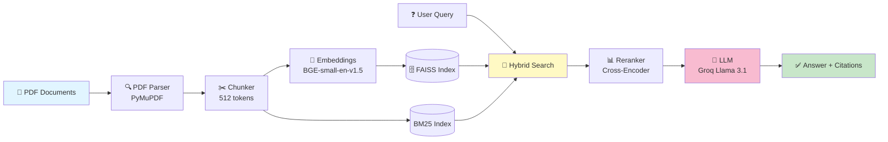

# SEC 10-K RAG System

[](https://colab.research.google.com/github/indhra/llm_rag_sec_findings/blob/main/notebooks/RAG_SEC_10K.ipynb)

> A RAG pipeline for answering financial and legal questions from Apple 2024 and Tesla 2023 SEC 10-K filings.

**Author:** Indhra  
**Date:** January 2026

📄 **[Design Report](design_report.md)** - Design decisions and architecture details

---

## 🎯 Objective

Build a RAG system that:
- Parses Apple's 2024 10-K and Tesla's 2023 10-K
- Answers complex financial/legal questions with proper citations
- Handles out-of-scope questions gracefully
- Uses only open-source/open-access LLMs

---

## 🏗️ Architecture



**Key Design Choices:**
- **Hybrid Search**: Vector + keyword search → better recall
- **Cross-Encoder Reranking**: Improves result precision  
- **Section-Aware Chunking**: Keeps document structure for citations

---

## 🚀 Quick Start

### Local Setup (Mac)

```bash
# Clone the repo
git clone https://github.com/indhra/llm_rag_sec_findings.git
cd llm_rag_sec_findings

# Install uv (if not already installed)
curl -LsSf https://astral.sh/uv/install.sh | sh

# Sync dependencies (creates .venv automatically)
uv sync

# Run the pipeline
uv run python -m src.pipeline
```

### Google Colab

[](COLAB_LINK_HERE)

---

## 📁 Project Structure

```
llm_rag_sec_findings/
├── data/
│   ├── 10-Q4-2024-As-Filed.pdf    # Apple 10-K
│   └── tsla-20231231-gen.pdf      # Tesla 10-K
├── src/
│   ├── __init__.py
│   ├── pdf_parser.py              # PDF text extraction
│   ├── chunker.py                 # Text chunking with metadata
│   ├── embeddings.py              # Vector embeddings
│   ├── vector_store.py            # FAISS + BM25 hybrid
│   ├── reranker.py                # Cross-encoder reranking
│   ├── llm.py                     # LLM integration
│   ├── pipeline.py                # Main RAG pipeline
│   └── test/
│       └── evaluate.py            # Evaluation script
├── notebooks/
│   └── RAG_SEC_10K.ipynb          # Runnable notebook
├── outputs/
│   └── answers.json               # Evaluation results
├── pyproject.toml                 # Project config & dependencies (uv)
├── uv.lock                        # Lockfile for reproducible installs
├── design_report.md               # Architecture explanation
└── README.md
```

---

## 💡 Usage

```python
from src import answer_question

result = answer_question("What was Apple's total revenue for FY 2024?")
print(result)
# {
#     "answer": "Apple's total revenue for fiscal year 2024 was $391,036 million.",
#     "sources": ["Apple 10-K", "Item 8", "p. 282"]
# }
```

---

## 📊 Evaluation

Run the evaluation script:

```bash
python -m src.test.evaluate
```

The system is evaluated on 13 test questions (10 answerable, 3 out-of-scope):

| Question Type | Expected Behavior |
|---------------|-------------------|
| Factual (Q1-10) | Answer with citation |
| Out-of-scope (Q11-13) | "This question cannot be answered based on the provided documents." |

---

## 🔧 Configuration

Set up your LLM API key in `.env`:

```bash
# Option 1: Groq (recommended - free tier, fast)
GROQ_API_KEY=your_groq_api_key

# Option 2: HuggingFace
HF_TOKEN=your_huggingface_token

# Option 3: Together AI
TOGETHER_API_KEY=your_together_api_key
```

---

## 📄 License

MIT License

---

## 🙏 Acknowledgments

- Apple and Tesla SEC filings are public documents
- Built with open-source tools: PyMuPDF, FAISS, sentence-transformers
