# LLM Fundamentals: From Basics to Transformers

> **Learning Goal**: Understand the core architecture and mechanisms that power modern Large Language Models.

---

## Table of Contents
1. [What are LLMs?](#what-are-llms)
2. [Evolution: RNNs → LSTMs → Transformers](#evolution)
3. [Transformer Architecture](#transformer-architecture)
4. [Attention Mechanism](#attention-mechanism)
5. [Tokenization](#tokenization)
6. [Interview Essentials](#interview-essentials)

---

## What are LLMs?

**Large Language Models (LLMs)** are neural networks trained on massive text corpora to predict and generate human-like text.

### Key Characteristics

| Property | Description | Example |
|----------|-------------|---------|
| **Scale** | Billions of parameters | GPT-4: ~1.7T, Llama 3.1: 8B-405B |
| **Pre-training** | Trained on internet-scale text | Web pages, books, code |
| **Transfer Learning** | Can be fine-tuned for specific tasks | ChatGPT, coding assistants |
| **Emergent Abilities** | Capabilities that appear at scale | Chain-of-thought reasoning |

### LLM Timeline


---

## Evolution: RNNs → LSTMs → Transformers {#evolution}

### The Problem: Sequential Processing

```mermaid
graph LR
    A[Word 1] --> B[Hidden State 1]
    B --> C[Word 2]
    C --> D[Hidden State 2]
    D --> E[Word 3]
    E --> F[Hidden State 3]
    
    style A fill:#e3f2fd
    style C fill:#e3f2fd
    style E fill:#e3f2fd
    
    G[⚠️ Issues] --> H[Sequential → Slow]
    G --> I["Long-term dependencies lost"]
    G --> J[Vanishing gradients]
```



### Why Transformers Won

| Architecture | Pros | Cons | Speed |
|--------------|------|------|-------|
| **RNN** | Simple, sequential | Poor long-term memory | Slow (sequential) |
| **LSTM** | Better memory | Complex, still sequential | Slow |
| **Transformer** | ✅ Parallel processing, ✅ Long-range dependencies, ✅ Attention mechanism | Large memory requirements | **Fast** (parallel) |

---

## Transformer Architecture

The transformer architecture from "Attention is All You Need" (2017) revolutionized NLP.


### Key Components

#### 1. **Embeddings + Positional Encoding**

```python
# Conceptual example (not actual code)
token_embedding = model.embed("cat")  # [0.23, -0.45, 0.67, ...]
position_encoding = sin_cos_encoding(position=1)  # [0.84, 0.54, ...]
final_embedding = token_embedding + position_encoding
```

**Why positional encoding?** Transformers process all tokens in parallel, so we need to inject position information.

#### 2. **Self-Attention** (The Game Changer)

**Goal**: Let each word "attend to" (look at) all other words to understand context.

```mermaid
graph TD
    subgraph "Self-Attention for 'bank'"
        W1["Input: 'The river bank'"] --> Q["Query: What am I looking for?"]
        W1 --> K["Key: What do I represent?"]
        W1 --> V["Value: What information do I carry?"]
        
        Q --> S["Similarity Scores"]
        K --> S
        S --> A["Attention Weights (river: 0.7, the: 0.1, bank: 0.2)"]
        A --> O["Weighted Sum of Values"]
        V --> O
        O --> OUT["Context-aware 'bank' → riverbank, not financial"]
    end
    
    style S fill:#fff9c4
    style A fill:#f8bbd0
    style OUT fill:#c8e6c9
```



**Mathematical Formulation:**

$$
\text{Attention}(Q, K, V) = \text{softmax}\left(\frac{QK^T}{\sqrt{d_k}}\right)V
$$

Where:
- $Q$ = Query matrix (what I'm looking for)
- $K$ = Key matrix (what I represent)
- $V$ = Value matrix (information to pass forward)
- $d_k$ = dimension of keys (scaling factor)

#### 3. **Multi-Head Attention**

Instead of one attention mechanism, use multiple "heads" to capture different relationships:


**Real Example from Llama 3.1 8B:**
- 32 attention heads
- Each head learns different patterns
- Head 1 might learn subject-verb agreement
- Head 5 might learn entity relationships

---

## Attention Mechanism Deep Dive {#attention-mechanism}

### The Intuition

Think of attention as a **similarity search**:

```mermaid
graph TD
    Q["Query: 'bank' - What context do I need?"] --> S1{"Compare with each word"}
    
    S1 --> K1["Key: 'river' - Score: 0.9 ✅"]
    S1 --> K2["Key: 'the' - Score: 0.1"]
    S1 --> K3["Key: 'bank' - Score: 0.3"]
    
    K1 --> W["Weighted combination"]
    K2 --> W
    K3 --> W
    
    W --> O["Context-aware 'bank' = riverbank"]
    
    style K1 fill:#c8e6c9
    style O fill:#66bb6a
```



### Attention Variations

| Type | Used In | Purpose |
|------|---------|---------|
| **Self-Attention** | BERT, GPT | Word attends to words in same sequence |
| **Cross-Attention** | Encoder-Decoder | Decoder attends to encoder outputs |
| **Masked Self-Attention** | GPT | Prevent looking at future tokens |
| **Multi-Query Attention** | Llama 3.1 | Share keys/values across heads → faster |
| **Grouped-Query Attention** | Modern LLMs | Balance between multi-head and multi-query |

### Why Attention Works

**Problem with RNNs**: Information from early tokens gets "diluted" through sequential processing.

**Solution with Attention**: Direct connections between any token pair!


---

## Tokenization

**Tokenization** = Converting text into numerical units that LLMs can process.

### Tokenization Methods


### Modern Approach: Byte-Pair Encoding (BPE)

**Used by**: GPT-3/4, Llama, most modern LLMs

**How it works:**

1. Start with characters
2. Merge most frequent pairs
3. Build vocabulary of ~50k tokens

```python
# Example from your project (conceptual)
text = "embedding embeddings"

# BPE tokenization:
tokens = ["emb", "edd", "ing", "emb", "edd", "ings"]
# Note: "ing" and "ings" are separate tokens
```

### Token Vocabulary Sizes

| Model | Vocabulary Size | Average Tokens/Word |
|-------|----------------|---------------------|
| GPT-2 | 50,257 | ~1.3 |
| GPT-3/4 | 50,257 | ~1.3 |
| Llama 2/3 | 32,000 | ~1.4 |
| Claude | ~100,000 | ~0.9 |

### Why Tokenization Matters

**In your project:**
```python
# src/chunker.py - chunk size = 512 tokens
# This is ~400-600 words depending on content
# Financial text → more specialized terms → slightly more tokens
```

**Context Window Impact:**
- Llama 3.1 8B: 128k token context window
- Your chunks: 512 tokens each
- Can fit ~250 chunks in context (but you use top 5-7)

---

## Interview Essentials

### Must-Know Concepts

1. **Why Transformers over RNNs?**
   - ✅ Parallel processing → faster training
   - ✅ Better long-range dependencies via attention
   - ✅ No vanishing gradient issues

2. **What is attention?**
   - Mechanism to weigh importance of different inputs
   - Query, Key, Value framework
   - Enables context-aware representations

3. **Encoder vs Decoder?**
   - **Encoder** (BERT): Bidirectional, good for understanding
   - **Decoder** (GPT): Unidirectional, good for generation
   - **Encoder-Decoder** (T5): Best for translation/summarization

4. **Position Encoding - Why needed?**
   - Transformers process all tokens in parallel
   - Need to inject position information
   - Sin/cos functions provide unique position embeddings

### Real-World Examples

**From Your Project:**

```python
# src/embeddings.py uses BGE-small-en-v1.5
# This is a BERT-style encoder:
# - Input: "Apple's total revenue"
# - Output: 384-dim vector capturing semantic meaning
# - Uses 12 transformer layers
# - 6 attention heads per layer
```

**Common Interview Question:**

> **Q**: "Why do we normalize embeddings in your code?"

```python
# src/embeddings.py line ~150
embeddings = embeddings / np.linalg.norm(embeddings, axis=1)[:, np.newaxis]
```

> **A**: "Normalized embeddings enable cosine similarity = dot product. This makes vector search faster (just dot product, no need to divide by magnitudes) and more stable."

### Architecture Comparison


---

## Further Reading

- 📄 **Paper**: [Attention is All You Need](https://arxiv.org/abs/1706.03762) (Vaswani et al., 2017)
- 📄 **Paper**: [BERT: Pre-training of Deep Bidirectional Transformers](https://arxiv.org/abs/1810.04805)
- 📄 **Paper**: [Language Models are Few-Shot Learners](https://arxiv.org/abs/2005.14165) (GPT-3)
- 🎥 **Video**: [The Illustrated Transformer](http://jalammar.github.io/illustrated-transformer/)

---

## Key Takeaways

✅ **Transformers revolutionized NLP** through parallel processing and attention  
✅ **Attention mechanism** lets models focus on relevant context dynamically  
✅ **Tokenization** converts text to numerical representations  
✅ **Positional encoding** provides sequence order information  
✅ **Multi-head attention** captures different linguistic patterns  

**Next**: [Embeddings and Vector Representations →](02-embeddings-vectors.md)
