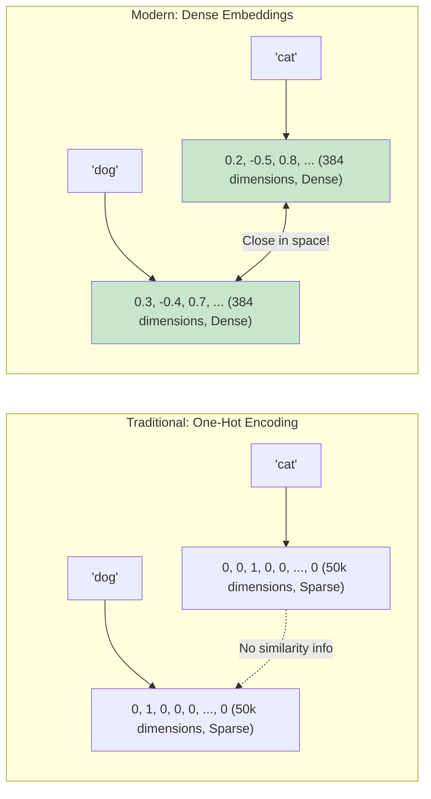
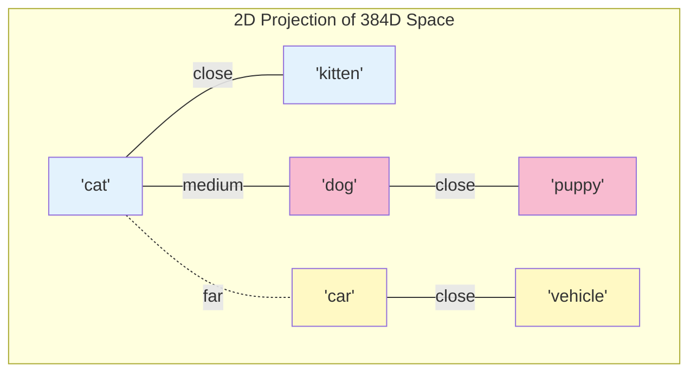
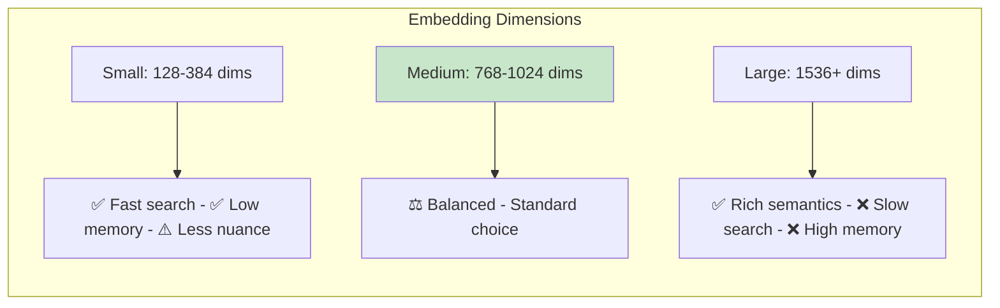
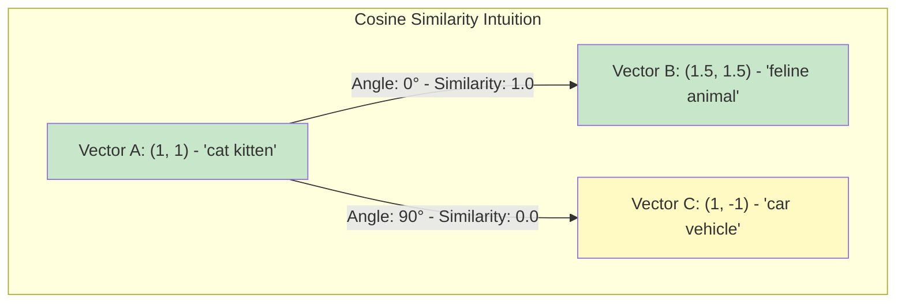
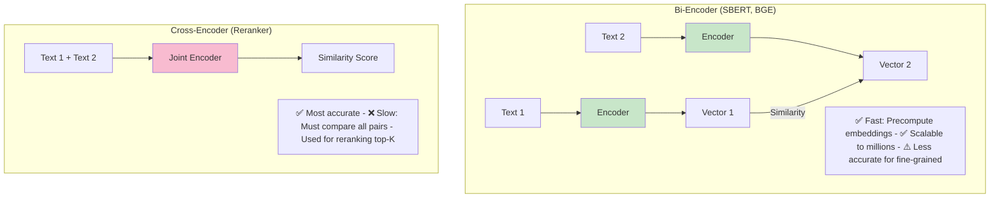
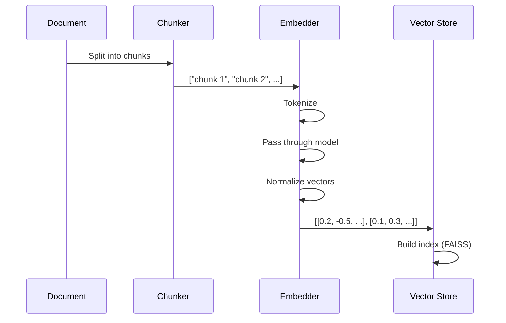
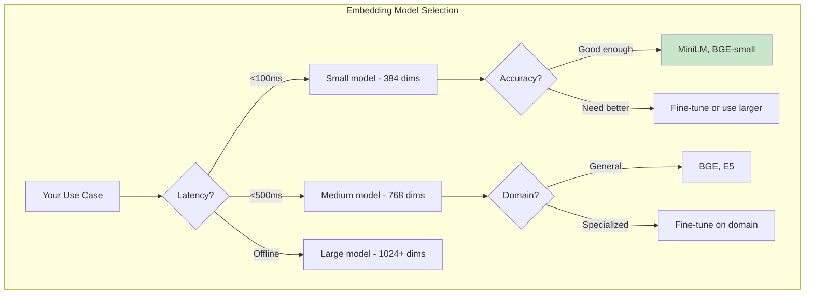
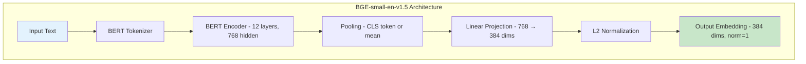

# Embeddings and Vector Representations

> **Learning Goal**: Master how text becomes numbers and how similarity search powers modern AI systems.

---

## Table of Contents
1. [What Are Embeddings?](#what-are-embeddings)
2. [Vector Spaces and Semantic Similarity](#vector-spaces)
3. [Similarity Metrics](#similarity-metrics)
4. [Embedding Models](#embedding-models)
5. [Practical Implementation](#practical-implementation)
6. [Interview Essentials](#interview-essentials)

---

## What Are Embeddings?

**Embeddings** = Dense vector representations that capture semantic meaning of text, images, or other data.

### The Core Idea



### Why Embeddings Matter

| Problem | One-Hot | Embeddings |
|---------|---------|------------|
| **Vocabulary Size** | 50k+ dimensions | 384-1024 dimensions |
| **Semantic Similarity** | ❌ No relationship captured | ✅ Similar words → similar vectors |
| **Generalization** | ❌ New words = unknown | ✅ Subword tokens handle new words |
| **Storage** | Sparse, inefficient | Dense, compact |

---

## Vector Spaces and Semantic Similarity {#vector-spaces}

### Geometric Intuition

Embeddings live in a **high-dimensional space** where semantic meaning = geometric proximity.



### Real Example from Your Project

```python
# src/embeddings.py uses BGE-small-en-v1.5
# Input texts:
text1 = "Apple's total revenue for fiscal year 2024"
text2 = "Apple's net sales in 2024"  
text3 = "Tesla's car production"

# Embeddings (384 dimensions each):
emb1 = [0.23, -0.45, 0.12, ..., 0.67]  # 384 floats
emb2 = [0.25, -0.42, 0.15, ..., 0.69]  # Very similar to emb1!
emb3 = [0.01, -0.23, 0.89, ..., -0.34] # Different from emb1, emb2
```

### Dimensionality Tradeoffs



| Model | Dimensions | Use Case |
|-------|-----------|----------|
| **all-MiniLM-L6-v2** | 384 | Fast, lightweight, good baseline |
| **BGE-small** | 384 | Your project - balanced performance |
| **BGE-large** | 1024 | Higher quality, slower |
| **OpenAI text-embedding-3-large** | 3072 | Best quality, expensive |

---

## Similarity Metrics {#similarity-metrics}

### Cosine Similarity (Most Common)

**Measures the angle between vectors**, ignoring magnitude.

$$
\text{cosine\_similarity}(A, B) = \frac{A \cdot B}{||A|| \times ||B||} = \frac{\sum_{i=1}^{n} A_i B_i}{\sqrt{\sum_{i=1}^{n} A_i^2} \times \sqrt{\sum_{i=1}^{n} B_i^2}}
$$

**Range**: -1 (opposite) to +1 (identical)



**Why cosine?**
- ✅ Normalized: Focuses on direction, not magnitude
- ✅ Works well for text embeddings
- ✅ Fast computation (just dot product if vectors are normalized)

### Dot Product

$$
\text{dot\_product}(A, B) = \sum_{i=1}^{n} A_i \times B_i
$$

**When vectors are normalized (L2 norm = 1):**
$$
\text{cosine\_similarity} = \text{dot\_product}
$$

**In your project:**
```python
# src/embeddings.py - line ~150
# Normalize embeddings → cosine similarity = dot product
embeddings = embeddings / np.linalg.norm(embeddings, axis=1, keepdims=True)

# FAISS then uses dot product for speed
index = faiss.IndexFlatIP(dimension)  # IP = Inner Product
```

### Euclidean Distance (L2)

$$
\text{distance}(A, B) = \sqrt{\sum_{i=1}^{n} (A_i - B_i)^2}
$$

**Range**: 0 (identical) to ∞ (very different)

**Less common for embeddings** because it's sensitive to magnitude.

### Comparison

| Metric | Formula | Best For | Your Project |
|--------|---------|----------|--------------|
| **Cosine** | Angle between vectors | Text embeddings | ✅ Used (via normalization) |
| **Dot Product** | Sum of products | Fast search on normalized vectors | ✅ Used in FAISS |
| **Euclidean** | Straight-line distance | Low-dim data, image features | ❌ Not used |

---

## Embedding Models {#embedding-models}

### Architecture Types



### Popular Models (2025-2026)

| Model | Dimensions | MTEB Score | Speed | Best For |
|-------|-----------|------------|-------|----------|
| **all-MiniLM-L6-v2** | 384 | 58.0 | ⚡⚡⚡ Fast | Development, testing |
| **BGE-small-en-v1.5** | 384 | 62.5 | ⚡⚡ Medium | **Your project** - balanced |
| **BGE-large-en-v1.5** | 1024 | 64.2 | ⚡ Slow | High-quality retrieval |
| **bge-m3** | 1024 | 66.3 | ⚡ Slow | Multilingual |
| **GTE-large** | 1024 | 63.5 | ⚡ Slow | General-purpose |
| **E5-mistral-7b** | 4096 | 68.2 | 🐌 Very slow | Best quality, GPU needed |

**MTEB** = Massive Text Embedding Benchmark (higher = better)

### Fine-Tuning for Your Domain


**When to fine-tune:**
- ✅ Highly specialized domain (legal, medical, finance)
- ✅ Have 1000+ query-document pairs
- ✅ Baseline retrieval <70% recall

**Your project:** Uses pretrained BGE-small → works well for financial text without fine-tuning!

---

## Practical Implementation {#practical-implementation}

### From Your Project

```python
# src/embeddings.py - Simplified

from sentence_transformers import SentenceTransformer
import numpy as np

class EmbeddingGenerator:
    def __init__(self, model_name="bge-small"):
        # Load pretrained model
        self.model = SentenceTransformer(
            "BAAI/bge-small-en-v1.5",
            device="cpu"
        )
        self.dimension = 384
    
    def embed_texts(self, texts: List[str]) -> np.ndarray:
        """Convert texts to embeddings."""
        # Generate embeddings
        embeddings = self.model.encode(
            texts,
            normalize_embeddings=True,  # L2 normalize → cosine = dot product
            show_progress_bar=True,
            batch_size=32
        )
        return embeddings  # Shape: (len(texts), 384)
```

### Embedding Process



### Batch Processing

**Why batch?** Models process multiple texts faster than one-by-one.

```python
# Inefficient (one-by-one):
for text in texts:
    emb = model.encode([text])  # Slow!

# Efficient (batched):
embeddings = model.encode(texts, batch_size=32)  # Much faster!
```

**Your project:**
```python
# src/pipeline.py - processes ~491 chunks in batches
chunks = chunker.chunk_all_documents(documents)  # 491 chunks
embeddings = embedder.embed_texts([c.content for c in chunks])
```

---

## Interview Essentials

### Key Concepts

**Q1: What are embeddings?**

> "Dense vector representations that capture semantic meaning in a continuous space. Unlike one-hot encoding, embeddings encode similarity - semantically similar inputs have similar vectors."

**Q2: Why normalize embeddings?**

```python
# Before normalization:
v1 = [3, 4]      # magnitude = 5
v2 = [6, 8]      # magnitude = 10, same direction as v1!

# Cosine similarity = 1.0 (identical direction)
# Dot product = 66 (misleading - different magnitudes)

# After normalization:
v1_norm = [0.6, 0.8]   # magnitude = 1
v2_norm = [0.6, 0.8]   # magnitude = 1

# Now: cosine similarity = dot product = 1.0 ✅
```

**Q3: Bi-encoder vs Cross-encoder?**

| Aspect | Bi-Encoder | Cross-Encoder |
|--------|------------|---------------|
| **Speed** | ⚡ Fast (precompute) | 🐌 Slow (pairwise) |
| **Accuracy** | Good | Better |
| **Scalability** | Millions of docs | Top-K only |
| **Use Case** | Initial retrieval | Reranking |

**Your project uses both!**
- Bi-encoder (BGE) for fast vector search
- Cross-encoder for reranking top results

### Real-World Tradeoffs



### Common Pitfalls

❌ **Mistake 1**: Using raw dot product without normalization
```python
# Wrong:
similarity = np.dot(emb1, emb2)  # Influenced by magnitude!

# Right:
emb1_norm = emb1 / np.linalg.norm(emb1)
emb2_norm = emb2 / np.linalg.norm(emb2)
similarity = np.dot(emb1_norm, emb2_norm)
```

❌ **Mistake 2**: Embedding queries and documents with different models

❌ **Mistake 3**: Not batching - 100x slower!

❌ **Mistake 4**: Forgetting to normalize before FAISS IndexFlatIP

### Code Examples from Your Project

**1. Embedding generation:**
```python
# src/embeddings.py
embeddings = model.encode(
    texts,
    normalize_embeddings=True,  # Critical for cosine similarity
    batch_size=32
)
```

**2. Similarity search:**
```python
# src/vector_store.py
query_embedding = self.embedder.embed_texts([query])[0]
distances, indices = self.index.search(
    query_embedding.reshape(1, -1),
    k=top_k
)
# distances are cosine similarities (because normalized + IndexFlatIP)
```

---

## Advanced: How BGE Model Works



**Training:** Contrastive learning with millions of (query, positive_doc, negative_doc) triplets.

---

## Further Reading

- 📄 **Paper**: [Sentence-BERT](https://arxiv.org/abs/1908.10084) (Reimers & Gurevych, 2019)
- 📄 **Paper**: [BGE Embedding](https://arxiv.org/abs/2309.07597) (BAAI, 2023)
- 📊 **Benchmark**: [MTEB Leaderboard](https://huggingface.co/spaces/mteb/leaderboard)
- 🎥 **Tutorial**: [Understanding Sentence Embeddings](https://www.sbert.net/)

---

## Key Takeaways

✅ **Embeddings** = dense vectors that encode semantic meaning  
✅ **Cosine similarity** measures semantic closeness  
✅ **Bi-encoders** (BGE, SBERT) enable fast, scalable retrieval  
✅ **Normalization** makes cosine similarity = dot product  
✅ **Dimensionality** trades off speed vs accuracy  

**Next**: [RAG Fundamentals →](03-rag-fundamentals.md)
