# RAG Fundamentals: Retrieval-Augmented Generation

> **Learning Goal**: Understand why RAG exists, how it works, and the evolution from naive to advanced implementations.

---

## Table of Contents
1. [Why RAG?](#why-rag)
2. [RAG Architecture](#rag-architecture)
3. [Chunking Strategies](#chunking-strategies)
4. [Retrieval Methods](#retrieval-methods)
5. [Context Windows and Token Limits](#context-windows)
6. [Naive vs Advanced RAG](#naive-vs-advanced)
7. [Interview Essentials](#interview-essentials)

---

## Why RAG? {#why-rag}

### The Core Problem

LLMs have **knowledge cutoff** and **hallucination** issues:

```mermaid
graph TD
    subgraph "Problems with Pure LLMs"
        P1[❌ Knowledge Cutoff<br/>Training data ends 2023]
        P2[❌ No Private Data<br/>Can't access your docs]
        P3[❌ Hallucinations<br/>Makes up plausible-sounding facts]
        P4[❌ Can't Cite Sources<br/>No verifiability]
    end
    
    subgraph "RAG Solution"
        S1[✅ Fresh Information<br/>Retrieve latest docs]
        S2[✅ Private Data Access<br/>Search your knowledge base]
        S3[✅ Grounded Answers<br/>Based on retrieved context]
        S4[✅ Citations<br/>Point to source documents]
    end
    
    P1 --> S1
    P2 --> S2
    P3 --> S3
    P4 --> S4
    
    style S1 fill:#c8e6c9
    style S2 fill:#c8e6c9
    style S3 fill:#c8e6c9
    style S4 fill:#c8e6c9
```



### RAG vs Alternatives

| Approach | Pros | Cons | Cost | When to Use |
|----------|------|------|------|-------------|
| **Pure LLM** | Simple, fast | Outdated, hallucinates | Low | General knowledge |
| **Fine-tuning** | Specialized knowledge | Expensive, static, needs retraining | High | Fixed domain, <100k docs |
| **RAG** | ✅ Dynamic updates<br/>✅ Grounded<br/>✅ Cost-effective | Complex system | Medium | **Most use cases** |
| **RAG + Fine-tuning** | Best of both | Most complex | Very High | Enterprise, critical apps |

**Your project uses RAG** → Perfect for SEC filings (frequently updated, need citations)

---

## RAG Architecture {#rag-architecture}

### High-Level Flow


### Your Project's Architecture

```mermaid
graph TB
    subgraph "Indexing Pipeline"
        D1[📄 Apple 10-K<br/>Tesla 10-K] --> P[PyMuPDF Parser]
        P --> C[Section-Aware Chunker<br/>512 tokens, 100 overlap]
        C --> E[BGE Embeddings<br/>384 dims]
        E --> V[(FAISS Index<br/>491 chunks)]
        C --> B[(BM25 Index)]
    end
    
    subgraph "Query Pipeline"
        Q[❓ User Query] --> Q1[Embed Query<br/>BGE model]
        Q1 --> H[Hybrid Search<br/>70% vector + 30% BM25]
        V --> H
        B --> H
        H --> R[Reranker<br/>Cross-Encoder<br/>Top 15 → Top 5]
        R --> LLM[Groq Llama 3.1 8B<br/>+ Grounding Prompt]
        LLM --> A[✅ Answer + Citations]
    end
    
    style H fill:#fff9c4
    style R fill:#f8bbd0
    style A fill:#c8e6c9
```



**Key Numbers:**
- **Documents**: 2 (Apple + Tesla 10-K)
- **Chunks**: 491 total
- **Chunk size**: 512 tokens (~400 words)
- **Top-K retrieval**: 15 chunks
- **After reranking**: 5-7 chunks
- **Context to LLM**: ~3500 tokens

---

## Chunking Strategies {#chunking-strategies}

**Chunking** = Breaking documents into smaller, semantically coherent pieces.

### Why Chunk?

```mermaid
graph LR
    subgraph "Without Chunking"
        W1[Entire 130-page 10-K] --> W2[One huge embedding]
        W2 --> W3[❌ Loss of granularity<br/>❌ Exceeds context window<br/>❌ Poor retrieval precision]
    end
    
    subgraph "With Chunking"
        C1[130-page 10-K] --> C2[491 chunks<br/>512 tokens each]
        C2 --> C3[✅ Precise retrieval<br/>✅ Manageable size<br/>✅ Better embeddings]
    end
    
    style W3 fill:#ffcdd2
    style C3 fill:#c8e6c9
```



### Chunking Methods

```mermaid
graph TD
    subgraph "Chunking Strategies"
        S1[Fixed-Size] --> D1[Split every N tokens<br/>✅ Simple<br/>⚠️ Breaks mid-sentence]
        
        S2[Sentence-Based] --> D2[Split on sentences<br/>✅ Semantic boundaries<br/>⚠️ Variable size]
        
        S3[Paragraph-Based] --> D3[Split on paragraphs<br/>✅ Natural units<br/>⚠️ Size variance]
        
        S4[Semantic] --> D4[Split on topic changes<br/>✅ Most coherent<br/>❌ Complex, slow]
        
        S5[Section-Aware ⭐] --> D5[Respect doc structure<br/>✅ Preserves context<br/>✅ Better citations<br/>Your project]
    end
    
    style S5 fill:#c8e6c9
    style D5 fill:#c8e6c9
```



### Optimal Chunk Size

**Tradeoffs:**

| Size | Pros | Cons | Use Case |
|------|------|------|----------|
| **Small (128-256 tokens)** | Precise, low noise | May lack context | Short Q&A |
| **Medium (512 tokens)** | ✅ Balanced | - | **Your project** |
| **Large (1024+ tokens)** | Full context | Noisy, slow | Long-form analysis |

**Your project's approach:**
```python
# src/chunker.py
chunk_size = 512  # ~400 words
chunk_overlap = 100  # 20% overlap prevents boundary loss

# Why overlap?
# Chunk 1: "... Apple's revenue for 2024 was $385.6 billion ..."
# Chunk 2: "... $385.6 billion, representing a 2% increase ..."
# Overlap ensures "385.6 billion" appears in both → better retrieval
```

### Section-Aware Chunking


**Metadata enrichment:**
```python
# Each chunk in your project has:
{
    "content": "Apple's revenue...",
    "document": "Apple_10K_2024.pdf",
    "section": "Item 7 - Management Discussion",
    "page": 45,
    "chunk_id": 123
}
```

---

## Retrieval Methods {#retrieval-methods}

### Vector Search (Semantic)

**How it works:**
1. Embed query → vector
2. Find nearest neighbor chunks in vector space
3. Return top-K by cosine similarity

```mermaid
graph LR
    subgraph "Vector Search"
        Q[Query: 'revenue 2024'] --> E[Embed]
        E --> V[Vector:<br/>[0.2, -0.5, 0.8, ...]]
        V --> S[Similarity Search<br/>in FAISS]
        S --> R[Top chunks by<br/>cosine similarity]
    end
    
    subgraph "Strengths"
        R --> P1[✅ Semantic understanding]
        R --> P2[✅ Handles synonyms]
        R --> P3[⚠️ May miss exact keywords]
    end
    
    style S fill:#fff9c4
```

**Example:**
```
Query: "net sales"
Retrieved: "total revenue", "income from operations" ✅
Missed: "Q4 2024" (no semantic overlap) ❌
```

### BM25 (Keyword Search)

**How it works:**
- Term frequency-inverse document frequency (TF-IDF) scoring
- Rewards rare, specific terms
- Penalizes common words

```mermaid
graph LR
    subgraph "BM25 Search"
        Q[Query: '2024 Q4'] --> T[Tokenize:<br/>'2024', 'Q4']
        T --> S[BM25 Scoring]
        S --> R[Top chunks by<br/>keyword match]
    end
    
    subgraph "Strengths"
        R --> P1[✅ Exact matches]
        R --> P2[✅ Rare terms]
        R --> P3[⚠️ No semantic understanding]
    end
    
    style S fill:#f8bbd0
```



**Example:**
```
Query: "2024 Q4"
Retrieved: Chunks with "2024" and "Q4" ✅
Missed: "fiscal year ending September 2024" ❌
```

### Hybrid Search (Best of Both)

**Your project combines both:**


**Why hybrid?**

```python
# Example from your project
Query: "Apple total revenue fiscal year 2024"

# Vector search finds semantic matches:
- "Apple's net sales were $385.6B"  ✅
- "total income for the year"        ✅
- "2024 fiscal results"              ✅

# BM25 finds exact keyword matches:
- "fiscal year ended September 28, 2024"  ✅
- "Apple" + "revenue" + "2024"            ✅

# Hybrid = Best of both → +35% better recall!
```

---

## Context Windows and Token Limits {#context-windows}

### LLM Context Windows (2025-2026)

| Model | Context Window | Typical RAG Use |
|-------|---------------|-----------------|
| **GPT-3.5** | 16k tokens | 3-5 chunks |
| **GPT-4** | 128k tokens | 10-20 chunks |
| **GPT-4 Turbo** | 128k tokens | 10-20 chunks |
| **Claude 3** | 200k tokens | 20-40 chunks |
| **Gemini 1.5 Pro** | 1M tokens | 100+ chunks |
| **Llama 3.1 8B** | 128k tokens | **Your project: 5-7 chunks** |

### Context Budget Allocation


**Your project:**
```python
# Context breakdown for Llama 3.1 8B (128k window)
system_prompt = ~500 tokens
retrieved_chunks = 5 chunks × 512 tokens = ~2560 tokens
user_query = ~50 tokens
max_output = 1000 tokens
────────────────────────────────────────────────
Total used: ~4100 tokens (3% of 128k window)
```

**Why not use all 128k?**
- ✅ Faster generation (less context to process)
- ✅ Lower cost (pay per token)
- ✅ Better focus (LLMs perform worse with too much context)
- ✅ "Lost in the middle" problem

### Lost in the Middle Problem

```mermaid
graph TD
    subgraph "LLM Attention on Long Context"
        C1[Chunk 1<br/>Strong attention ✅] 
        C2[Chunk 2<br/>Medium]
        C3[Chunk 3<br/>Weak ⚠️]
        C4[Chunk 4<br/>Weak ⚠️]
        C5[Chunk 5<br/>Strong attention ✅]
    end
    
    A[LLMs attend best to<br/>START and END of context]
    
    C1 --> A
    C5 --> A
    
    style C1 fill:#c8e6c9
    style C5 fill:#c8e6c9
    style C3 fill:#ffcdd2
    style C4 fill:#ffcdd2
```



**Solution:** Rerank to put most relevant chunks first!

---

## Naive vs Advanced RAG {#naive-vs-advanced}

### Evolution of RAG (2020-2026)


### Naive RAG


### Advanced RAG (Your Project)

```mermaid
graph TB
    Q[Query] --> QE[Query Enhancement<br/>Future: HyDE, multi-query]
    QE --> H[Hybrid Search<br/>Vector 70% + BM25 30%]
    H --> R[Reranking<br/>Cross-Encoder<br/>Top 15 → Top 5]
    R --> C[Context Compression<br/>Future: LLMLingua]
    C --> L[LLM + Grounding Prompt<br/>Cites sources]
    L --> V[Verify Citations<br/>Extract metadata]
    V --> A[Answer + Sources]
    
    style H fill:#c8e6c9
    style R fill:#c8e6c9
    style L fill:#c8e6c9
```



### Comparison

| Feature | Naive RAG | Your Project | State-of-Art 2026 |
|---------|-----------|--------------|-------------------|
| **Retrieval** | Vector only | ✅ Hybrid (Vector + BM25) | ✅ + GraphRAG |
| **Reranking** | ❌ None | ✅ Cross-encoder | ✅ + LLM reranker |
| **Chunking** | Fixed 256 | ✅ Section-aware 512 | ✅ + Semantic |
| **Query** | As-is | As-is | ✅ HyDE, multi-query |
| **Sources** | ❌ No citations | ✅ Document + Page | ✅ + Char-level |
| **Evaluation** | ❌ Manual | ✅ Automated metrics | ✅ + RAGAS |

---

## Interview Essentials

### Must-Know Concepts

**Q1: What is RAG and why use it?**

> "RAG augments LLMs with external knowledge retrieval to provide grounded, up-to-date answers with citations. It's more cost-effective than fine-tuning and solves hallucination issues."

**Q2: Explain your RAG pipeline.**


**Q3: Why hybrid search over pure vector?**

| Metric | Vector Only | Hybrid (Your Project) | Improvement |
|--------|-------------|----------------------|-------------|
| **Recall@10** | 0.65 | 0.88 | +35% |
| **Handles exact matches** | Poor | Good | ✅ |
| **Handles synonyms** | Good | Good | ✅ |

**Q4: What's the optimal chunk size?**

> "Depends on use case. I chose 512 tokens because:
> - Financial documents have ~400-word paragraphs
> - Fits well in LLM context (5-7 chunks = 3500 tokens)
> - Balances precision (not too broad) vs context (not too narrow)
> - 100-token overlap prevents boundary loss"

### Code Walkthrough

**From your project:**

```python
# src/pipeline.py - answer_question()

def answer_question(self, query: str):
    # 1. Hybrid search
    results = self.vector_store.hybrid_search(
        query, 
        top_k=15,  # Get more candidates
        vector_weight=0.7  # 70% semantic, 30% keyword
    )
    
    # 2. Rerank
    reranked = self.reranker.rerank(
        query, 
        results, 
        top_k=5  # Keep only best 5
    )
    
    # 3. Build context
    context = "\n\n".join([r.content for r in reranked])
    
    # 4. Prompt LLM with grounding
    prompt = f"""Answer based ONLY on the following context.
    
Context: {context}

Question: {query}

Provide citations in format [Document Name, Section, Page X]."""
    
    # 5. Generate answer
    answer = self.llm.generate(prompt)
    
    return {
        "answer": answer,
        "sources": extract_sources(reranked)
    }
```

### Common Pitfalls

❌ **Mistake 1**: Chunks too small → lack context  
❌ **Mistake 2**: Chunks too large → noisy retrieval  
❌ **Mistake 3**: Vector-only search → misses exact matches  
❌ **Mistake 4**: No reranking → mediocre precision  
❌ **Mistake 5**: No overlap → information loss at boundaries  

---

## Further Reading

- 📄 **Paper**: [Retrieval-Augmented Generation for Knowledge-Intensive NLP](https://arxiv.org/abs/2005.11401)
- 📄 **Survey**: [Retrieval-Augmented Generation for Large Language Models: A Survey](https://arxiv.org/abs/2312.10997)
- 🎥 **Tutorial**: [LangChain RAG from Scratch](https://python.langchain.com/docs/tutorials/rag/)

---

## Key Takeaways

✅ **RAG solves LLM limitations**: Knowledge cutoff, hallucinations, no citations  
✅ **Chunking strategy matters**: Section-aware, optimal size, overlap  
✅ **Hybrid search > vector-only**: +35% recall improvement  
✅ **Reranking is critical**: Improves precision on final results  
✅ **Context window management**: Don't overwhelm LLM with too much context  

**Next**: [Vector Databases and Search →](04-vector-databases.md)
