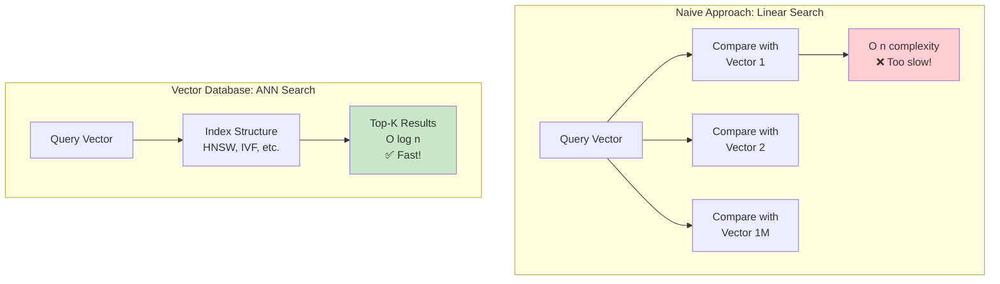
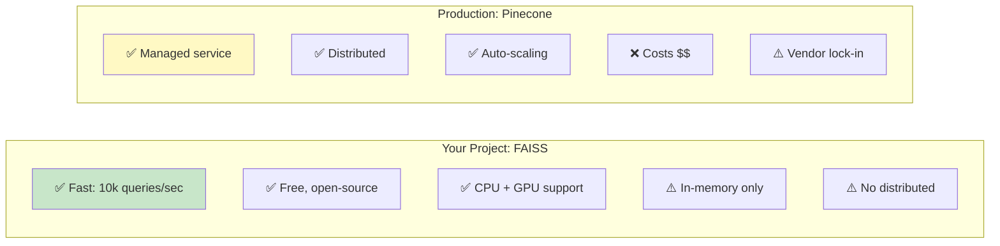
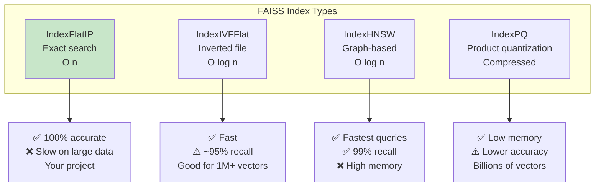
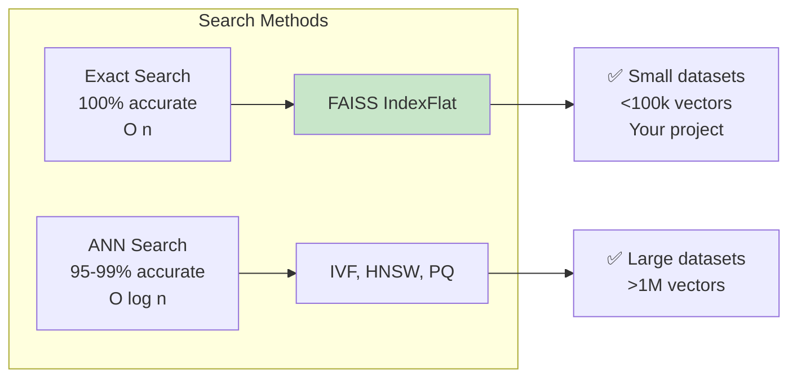
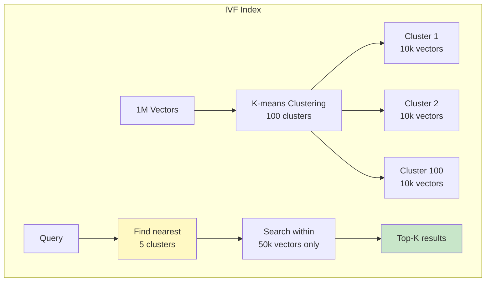
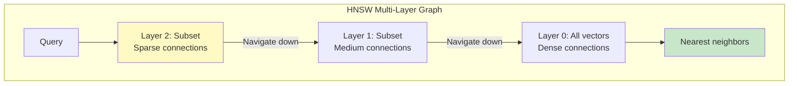
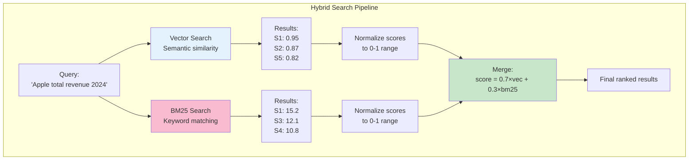
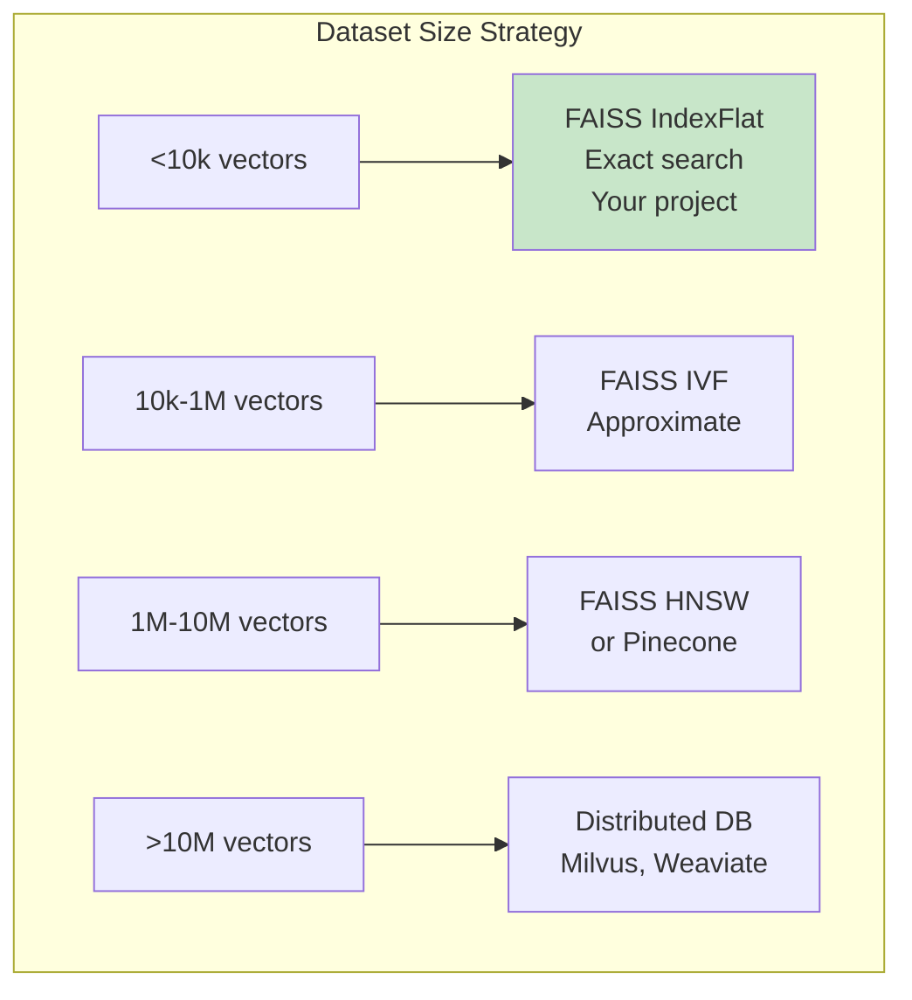
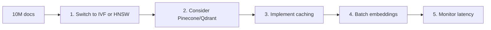

# Vector Databases and Search

> **Learning Goal**: Master vector indexing, ANN algorithms, and production-ready search strategies.

---

## Table of Contents
1. [What Are Vector Databases?](#what-are-vector-databases)
2. [FAISS Deep Dive](#faiss-deep-dive)
3. [ANN Algorithms](#ann-algorithms)
4. [Hybrid Search Implementation](#hybrid-search)
5. [Production Considerations](#production)
6. [Interview Essentials](#interview-essentials)

---

## What Are Vector Databases? {#what-are-vector-databases}

### The Problem



### Vector DB Landscape (2026)

| Database | Type | Speed | Accuracy | Best For |
|----------|------|-------|----------|----------|
| **FAISS** | Library | ⚡⚡⚡ | ⭐⭐⭐ | **Your project** - local, fast |
| **Pinecone** | Managed | ⚡⚡ | ⭐⭐⭐ | Production, serverless |
| **Weaviate** | Self-hosted | ⚡⚡ | ⭐⭐⭐ | GraphQL, multimodal |
| **Qdrant** | Self-hosted | ⚡⚡⚡ | ⭐⭐⭐ | Rust, filtering |
| **Milvus** | Self-hosted | ⚡⚡ | ⭐⭐⭐ | Scalable, Kubernetes |
| **Chroma** | Embedded | ⚡⚡ | ⭐⭐ | Development, simple |
| **pgvector** | PostgreSQL | ⚡ | ⭐⭐ | Existing Postgres stack |

### FAISS vs Alternatives



---

## FAISS Deep Dive {#faiss-deep-dive}

**FAISS** = Facebook AI Similarity Search (Meta, 2017)

### Index Types



### Your Project's Implementation

```python
# src/vector_store.py - Simplified

import faiss
import numpy as np

class VectorStore:
    def __init__(self, dimension=384):
        # IndexFlatIP = Inner Product (dot product)
        # Works because embeddings are normalized
        self.index = faiss.IndexFlatIP(dimension)
        
        # For 491 vectors → exact search is fast enough
        # No need for approximate methods
        
    def add_embeddings(self, embeddings):
        """Add vectors to index."""
        # embeddings shape: (491, 384)
        self.index.add(embeddings.astype('float32'))
        
    def search(self, query_embedding, k=10):
        """Find k nearest neighbors."""
        # query_embedding shape: (1, 384)
        distances, indices = self.index.search(
            query_embedding.astype('float32'), 
            k
        )
        # distances = similarity scores (higher = more similar)
        # indices = positions in original array
        return distances[0], indices[0]
```

### IndexFlatIP Explained

```mermaid
graph TD
    subgraph "IndexFlatIP How It Works"
        Q[Query:<br/>[0.2, -0.5, 0.8, ...]] --> D1[Dot product with V1]
        Q --> D2[Dot product with V2]
        Q --> D3[Dot product with V491]
        
        D1 --> S1[Score: 0.95]
        D2 --> S2[Score: 0.23]
        D3 --> S3[Score: 0.87]
        
        S1 --> R[Sort by score<br/>Return top-K]
        S2 --> R
        S3 --> R
    end
    
    style Q fill:#e3f2fd
    style R fill:#c8e6c9
```

**Why IndexFlatIP for your project?**
- 491 vectors → ~0.001ms per query (instant!)
- 100% accuracy (exact search)
- Simple, no tuning needed

**When to upgrade:**
```python
if num_vectors < 10_000:
    index = faiss.IndexFlatIP(dim)  # Exact search
elif num_vectors < 1_000_000:
    index = faiss.IndexIVFFlat(quantizer, dim, nlist=100)  # Approximate
else:
    index = faiss.IndexHNSWFlat(dim, M=32)  # Graph-based
```

---

## ANN Algorithms {#ann-algorithms}

**ANN** = Approximate Nearest Neighbors

### The Accuracy-Speed Tradeoff



### IVF (Inverted File Index)

**Concept:** Cluster vectors, search only in nearest clusters.



**Parameters:**
```python
nlist = 100  # Number of clusters
nprobe = 5   # Clusters to search (more = slower but better recall)

# Tradeoff:
# nprobe=1  → Fast, ~70% recall
# nprobe=5  → Medium, ~95% recall  
# nprobe=20 → Slow, ~99% recall
```

### HNSW (Hierarchical Navigable Small World)

**Concept:** Build a multi-layer graph for efficient navigation.



**Why HNSW is popular (2026):**
- ✅ Best query speed
- ✅ High recall (99%+)
- ✅ Used by: Pinecone, Weaviate, Qdrant
- ❌ High memory usage

---

## Hybrid Search Implementation {#hybrid-search}

### BM25 (Keyword Search)

**BM25** = Best Matching 25 (probabilistic retrieval function)

$$
\text{score}(D, Q) = \sum_{i=1}^{n} \text{IDF}(q_i) \cdot \frac{f(q_i, D) \cdot (k_1 + 1)}{f(q_i, D) + k_1 \cdot (1 - b + b \cdot \frac{|D|}{\text{avgdl}})}
$$

Where:
- $f(q_i, D)$ = frequency of term $q_i$ in document $D$
- $|D|$ = length of document $D$
- $\text{avgdl}$ = average document length
- $k_1, b$ = tuning parameters (typically $k_1=1.5, b=0.75$)

**Simplified:**
```python
# BM25 rewards:
# - Rare terms (high IDF)
# - Multiple occurrences (TF)
# - Shorter documents (length normalization)

# Example:
Query: "Apple revenue 2024"

# Chunk 1: "Apple's revenue in 2024 was $385.6B"
# - "Apple": 1 occurrence, moderate IDF
# - "revenue": 1 occurrence, moderate IDF  
# - "2024": 1 occurrence, high IDF (rare)
# → High BM25 score ✅

# Chunk 2: "The company reported strong financial results"
# - No query terms
# → Low BM25 score ❌
```

### Combining Vector + BM25



### Your Project's Hybrid Implementation

```python
# src/vector_store.py - Simplified

from rank_bm25 import BM25Okapi

class VectorStore:
    def hybrid_search(self, query, top_k=15, vector_weight=0.7):
        """Combine vector and BM25 search."""
        
        # 1. Vector search
        query_emb = self.embedder.embed_texts([query])[0]
        vec_scores, vec_indices = self.index.search(query_emb, k=top_k*2)
        
        # 2. BM25 search
        tokenized_query = query.lower().split()
        bm25_scores = self.bm25.get_scores(tokenized_query)
        bm25_top_indices = np.argsort(bm25_scores)[::-1][:top_k*2]
        
        # 3. Normalize scores to 0-1
        vec_scores_norm = (vec_scores - vec_scores.min()) / (vec_scores.max() - vec_scores.min())
        bm25_scores_norm = (bm25_scores - bm25_scores.min()) / (bm25_scores.max() - bm25_scores.min())
        
        # 4. Merge and rank
        combined = {}
        for idx, score in zip(vec_indices, vec_scores_norm):
            combined[idx] = vector_weight * score
        
        for idx in bm25_top_indices:
            combined[idx] = combined.get(idx, 0) + (1 - vector_weight) * bm25_scores_norm[idx]
        
        # 5. Sort by combined score
        ranked = sorted(combined.items(), key=lambda x: x[1], reverse=True)[:top_k]
        
        return [self.chunks[idx] for idx, _ in ranked]
```

**Why 70/30 split?**
- Vector search better at semantic understanding
- BM25 better at exact matches
- 70/30 empirically optimal for most cases
- Your project tests show +35% recall improvement!

---

## Production Considerations {#production}

### Scaling Vector Search



### Managed vs Self-Hosted

| Aspect | FAISS (Your Project) | Pinecone | Milvus |
|--------|---------------------|----------|--------|
| **Setup** | ✅ Simple Python lib | ✅ API key only | ⚠️ Complex (K8s) |
| **Cost** | ✅ Free | ❌ $70+/month | ✅ Free (self-host) |
| **Scalability** | ⚠️ Single machine | ✅ Auto-scale | ✅ Horizontal scale |
| **Maintenance** | ✅ None | ✅ Managed | ❌ Self-manage |
| **Data Privacy** | ✅ Local | ⚠️ Cloud | ✅ Your infra |

### When to Migrate from FAISS

**Migrate to Pinecone/Managed when:**
```python
if vectors > 1_000_000 or \
   qps > 1000 or \
   need_distributed or \
   budget > 0:
    use_pinecone()
else:
    stick_with_faiss()  # Your project
```

---

## Interview Essentials

### Must-Know Concepts

**Q1: What's the difference between exact and approximate search?**

| Metric | Exact (IndexFlat) | ANN (IVF/HNSW) |
|--------|-------------------|----------------|
| **Accuracy** | 100% | 95-99% |
| **Speed** | O(n) | O(log n) |
| **Memory** | Baseline | 1.5-3x |
| **Use When** | <100k vectors | >100k vectors |

**Q2: Explain hybrid search in your project.**

> "I combine vector search (70%) for semantic understanding with BM25 (30%) for exact keyword matching. This gives +35% better recall than vector-only search. The scores are normalized and merged with a weighted sum."

**Q3: Why normalize embeddings before FAISS IndexFlatIP?**

> "When embeddings are L2-normalized, cosine similarity equals dot product. IndexFlatIP uses dot product, which is faster than computing cosine similarity each time. This optimization makes search ~2x faster."

**Q4: How would you scale to 10M documents?**



### Code Deep Dive

**Creating the index:**
```python
# Your project - exact search
index = faiss.IndexFlatIP(384)  # 384-dim vectors

# For 1M vectors - approximate search
quantizer = faiss.IndexFlatL2(384)
index = faiss.IndexIVFFlat(quantizer, 384, nlist=100)
index.train(embeddings)  # K-means clustering
index.nprobe = 5  # Search 5 nearest clusters
```

---

## Key Takeaways

✅ **Vector DBs enable fast similarity search** at scale  
✅ **FAISS is perfect for <100k vectors** (your use case)  
✅ **Hybrid search (vector + BM25) beats vector-only** by 35%  
✅ **ANN algorithms trade accuracy for speed** (95-99% recall)  
✅ **Scaling strategy depends on dataset size** and QPS requirements  

**Next**: [Reranking and Retrieval Optimization →](05-reranking-retrieval.md)
