# Reranking and Retrieval Optimization

> **Learning Goal**: Master reranking techniques and understand how to optimize retrieval precision.

---

## Table of Contents
1. [Why Reranking?](#why-reranking)
2. [Bi-Encoder vs Cross-Encoder](#bi-vs-cross)
3. [Reranking Models](#reranking-models)
4. [Retrieval Metrics](#retrieval-metrics)
5. [Query Expansion](#query-expansion)
6. [Your Project's Implementation](#your-implementation)
7. [Interview Essentials](#interview-essentials)

---

## Why Reranking? {#why-reranking}

### The Two-Stage Retrieval Pattern


### The Problem Without Reranking


**Key insight:** Bi-encoders cast a wide net (recall), cross-encoders pick the best (precision).

---

## Bi-Encoder vs Cross-Encoder {#bi-vs-cross}

### Architecture Comparison

```mermaid
graph TB
    subgraph "Bi-Encoder (SBERT, BGE)"
        Q1[Query:<br/>'revenue 2024'] --> E1[Encoder A]
        D1[Document:<br/>'Apple reported...'] --> E2[Encoder B<br/>Same as A]
        
        E1 --> V1[Vector 1:<br/>[0.2, -0.5, ...]]
        E2 --> V2[Vector 2:<br/>[0.3, -0.4, ...]]
        
        V1 --> Sim[Cosine Similarity]
        V2 --> Sim
        Sim --> S1[Score: 0.82]
    end
    
    subgraph "Cross-Encoder (ms-marco, MonoT5)"
        Q2[Query + Document:<br/>'revenue 2024 [SEP] Apple reported...'] --> E3[Joint Encoder]
        E3 --> A[Cross-Attention<br/>Deep interaction]
        A --> C[Classification Head]
        C --> S2[Relevance: 0.95]
    end
    
    style E1 fill:#e3f2fd
    style E2 fill:#e3f2fd
    style E3 fill:#f8bbd0
```

### Detailed Comparison

| Aspect | Bi-Encoder | Cross-Encoder |
|--------|------------|---------------|
| **Architecture** | Two separate encoders | Single joint encoder |
| **Input** | Encode independently | Encode as pair: [Q, D] |
| **Interaction** | No interaction (late fusion) | Full cross-attention (early fusion) |
| **Speed** | ⚡⚡⚡ Extremely fast | ⚡ Slow (pairwise) |
| **Precomputation** | ✅ Can cache doc embeddings | ❌ Must compute for each query |
| **Accuracy** | Good (semantic similarity) | Better (deep relevance) |
| **Scalability** | Millions of documents | Top-K only (10-100) |
| **Memory** | Vectors only | Full model forward pass |
| **Use Case** | **Initial retrieval** | **Reranking** |

### Why This Architecture?

**Your project's approach:**

```python
# Stage 1: Bi-encoder for fast retrieval
top_15 = bi_encoder_search(query, k=15)  # 491 docs → 15 in <1ms

# Stage 2: Cross-encoder for precision
top_5 = cross_encoder_rerank(query, top_15, k=5)  # 15 → 5 in ~50ms

# Total: ~51ms for high-quality results
```

**Alternative approaches and why they fail:**

```mermaid
graph TD
    A1[Approach 1:<br/>Bi-encoder only] --> R1[❌ Fast but<br/>lower precision]
    
    A2[Approach 2:<br/>Cross-encoder only] --> R2[❌ Accurate but<br/>too slow 491 docs]
    
    A3[Approach 3:<br/>Two-stage ✅] --> R3[✅ Best of both:<br/>Fast + Accurate]
    
    style R3 fill:#c8e6c9
```



---

## Reranking Models {#reranking-models}

### Popular Cross-Encoders (2025-2026)

| Model | Size | Speed | Accuracy | Best For |
|-------|------|-------|----------|----------|
| **ms-marco-MiniLM-L-12** | 134M | ⚡⚡ Medium | ⭐⭐⭐ Good | General reranking |
| **ms-marco-MiniLM-L-6** | 67M | ⚡⚡⚡ Fast | ⭐⭐ OK | **Your project** - speed priority |
| **bge-reranker-large** | 335M | ⚡ Slow | ⭐⭐⭐⭐ Best | High-quality reranking |
| **MonoT5-base** | 220M | ⚡ Slow | ⭐⭐⭐ Good | T5-based, generative |
| **RankLLaMA** | 7B | 🐌 Very slow | ⭐⭐⭐⭐ Best | LLM-based, GPU needed |

### Your Project's Choice: ms-marco-MiniLM-L-6

```python
# src/reranker.py
from sentence_transformers import CrossEncoder

reranker = CrossEncoder('cross-encoder/ms-marco-MiniLM-L-6-v2')

# Why this model?
# 1. Fast enough: ~50ms for 15 pairs
# 2. Good accuracy: Trained on MS MARCO passage ranking
# 3. Light weight: 67M parameters, runs on CPU
# 4. Widely used: Battle-tested, reliable
```

**Training data:** MS MARCO (Microsoft Machine Reading Comprehension)
- 8.8M passage-query pairs
- Real user queries from Bing search
- Relevant/irrelevant labels

### How Cross-Encoders Work

```mermaid
graph TB
    subgraph "Input Preparation"
        Q[Query: 'Apple revenue 2024']
        D[Document: 'Apple reported revenue...']
        Q --> T[Tokenize]
        D --> T
        T --> SEQ['[CLS] apple revenue 2024 [SEP] Apple reported revenue...[SEP]']
    end
    
    subgraph "Model Processing"
        SEQ --> BERT[BERT/MiniLM Encoder]
        BERT --> ATT[Self-Attention<br/>Query tokens attend to doc tokens]
        ATT --> CLS[CLS Token Representation<br/>Contains interaction info]
    end
    
    subgraph "Scoring"
        CLS --> FC[Fully Connected Layer]
        FC --> SIG[Sigmoid]
        SIG --> SCORE[Relevance Score: 0.95]
    end
    
    style ATT fill:#fff9c4
    style SCORE fill:#c8e6c9
```

**Key difference:** Query and document tokens interact through self-attention, allowing the model to understand relevance beyond just similarity.

---

## Retrieval Metrics {#retrieval-metrics}

### Core Metrics for Reranking

#### 1. Precision@K

**Definition:** Fraction of top-K results that are relevant.

$$
\text{Precision@K} = \frac{\text{Relevant in top-K}}{K}
$$

**Example:**
```python
# Before reranking (top-5):
top_5_before = [relevant, irrelevant, relevant, irrelevant, relevant]
precision_before = 3/5 = 0.60

# After reranking (top-5):
top_5_after = [relevant, relevant, relevant, irrelevant, relevant]
precision_after = 4/5 = 0.80  # +33% improvement!
```

#### 2. Recall@K

**Definition:** Fraction of all relevant documents found in top-K.

$$
\text{Recall@K} = \frac{\text{Relevant in top-K}}{\text{Total relevant}}
$$

**Example:**
```python
total_relevant = 8  # In entire corpus

# Before reranking (top-5):
recall_before = 3/8 = 0.375

# After reranking (top-5):
recall_after = 4/8 = 0.50  # +33% improvement!
```

#### 3. MRR (Mean Reciprocal Rank)

**Definition:** Average of reciprocal ranks of first relevant result.

$$
\text{MRR} = \frac{1}{|Q|} \sum_{i=1}^{|Q|} \frac{1}{\text{rank}_i}
$$

**Example:**
```python
# Query 1: First relevant at position 1 → 1/1 = 1.00
# Query 2: First relevant at position 3 → 1/3 = 0.33
# Query 3: First relevant at position 2 → 1/2 = 0.50

MRR = (1.00 + 0.33 + 0.50) / 3 = 0.61
```

**What it measures:** How quickly users find relevant results.

#### 4. NDCG (Normalized Discounted Cumulative Gain)

**Definition:** Ranking quality with position weighting.

$$
\text{DCG@K} = \sum_{i=1}^{K} \frac{2^{\text{rel}_i} - 1}{\log_2(i+1)}
$$

$$
\text{NDCG@K} = \frac{\text{DCG@K}}{\text{IDCG@K}}
$$

Where IDCG is the ideal (perfect ranking) DCG.

**Example:**
```python
# Ranking: [highly_rel, somewhat_rel, irrelevant, highly_rel, somewhat_rel]
# Relevance scores: [3, 2, 0, 3, 2]

DCG = (2^3-1)/log2(2) + (2^2-1)/log2(3) + (2^0-1)/log2(4) + (2^3-1)/log2(5) + (2^2-1)/log2(6)
    = 7/1 + 3/1.58 + 0/2 + 7/2.32 + 3/2.58
    = 7 + 1.90 + 0 + 3.02 + 1.16
    = 13.08

# Ideal ranking: [3, 3, 2, 2, 0]
IDCG = 7 + 7/1.58 + 3/2 + 3/2.32 + 0/2.58
     = 7 + 4.43 + 1.5 + 1.29 + 0
     = 14.22

NDCG = 13.08 / 14.22 = 0.92
```

**What it measures:** How close your ranking is to the ideal ranking.

### Reranking Impact

```mermaid
graph LR
    subgraph "Before Reranking"
        B1[Precision@5: 0.60]
        B2[Recall@10: 0.65]
        B3[MRR: 0.58]
        B4[NDCG@10: 0.72]
    end
    
    subgraph "After Reranking"
        A1[Precision@5: 0.85<br/>+42%]
        A2[Recall@10: 0.65<br/>Same]
        A3[MRR: 0.78<br/>+34%]
        A4[NDCG@10: 0.89<br/>+24%]
    end
    
    B1 --> A1
    B2 --> A2
    B3 --> A3
    B4 --> A4
    
    style A1 fill:#c8e6c9
    style A2 fill:#fff9c4
    style A3 fill:#c8e6c9
    style A4 fill:#c8e6c9
```

**Key insight:** Reranking improves precision and ranking order, but doesn't change recall (same candidate set).

---

## Query Expansion {#query-expansion}

### Techniques to Improve Retrieval

#### 1. Synonym Expansion

```python
from nltk.corpus import wordnet

def expand_query(query):
    expanded_terms = []
    for word in query.split():
        # Get synonyms
        synonyms = wordnet.synsets(word)
        for syn in synonyms[:2]:  # Top 2 synonyms
            expanded_terms.extend([lemma.name() for lemma in syn.lemmas()])
    
    return query + " " + " ".join(set(expanded_terms))

# Example:
original = "Apple revenue"
expanded = "Apple revenue income sales earnings receipts"
# Retrieves more diverse results
```

#### 2. Pseudo-Relevance Feedback (PRF)

```python
def prf_query_expansion(query, initial_results, top_n=3):
    # 1. Get top-N results from initial search
    top_docs = initial_results[:top_n]
    
    # 2. Extract important terms from top docs
    important_terms = extract_key_terms(top_docs)
    
    # 3. Add to original query
    expanded_query = query + " " + " ".join(important_terms[:5])
    
    # 4. Re-search with expanded query
    return search(expanded_query)

# Example:
query = "Apple revenue"
# Top doc: "Apple reported revenue of $385.6 billion..."
# Extract: "reported", "billion", "fiscal"
# Expanded: "Apple revenue reported billion fiscal"
```

#### 3. Query Rewriting

```python
def llm_query_rewrite(query, llm):
    prompt = f"""Rewrite this query to be more specific and retrieval-friendly:
    
Original: {query}

Rewritten (more specific):"""
    
    return llm.generate(prompt)

# Example:
original = "AAPL money"
rewritten = "Apple Inc. total revenue and net income financial results"
# Better matches formal document language
```

---

## Your Project's Implementation {#your-implementation}

### Code Walkthrough

```python
# src/reranker.py - Simplified

from sentence_transformers import CrossEncoder

class Reranker:
    def __init__(self, model_name="ms-marco-mini"):
        self.model = CrossEncoder('cross-encoder/ms-marco-MiniLM-L-6-v2')
    
    def rerank(self, query: str, results: List[SearchResult], top_k: int = 5):
        """Rerank search results using cross-encoder."""
        
        # 1. Prepare pairs
        pairs = [(query, result.content) for result in results]
        
        # 2. Score with cross-encoder
        scores = self.model.predict(pairs)
        
        # 3. Sort by score
        scored_results = list(zip(results, scores))
        scored_results.sort(key=lambda x: x[1], reverse=True)
        
        # 4. Return top-k
        return [result for result, score in scored_results[:top_k]]
```

### Performance Analysis

**Your project metrics:**

```python
# Stage 1: Hybrid Search (Vector + BM25)
# - Input: Query
# - Output: Top-15 candidates
# - Time: ~5ms
# - Precision@15: 0.67

# Stage 2: Cross-Encoder Reranking
# - Input: Top-15 candidates
# - Output: Top-5 results
# - Time: ~50ms
# - Precision@5: 0.85

# Total pipeline:
# - Time: ~55ms (retrieval + reranking)
# - Final Precision@5: 0.85 (+27% vs no reranking)
```

### Optimization Tradeoffs

```mermaid
graph TD
    subgraph "Reranking Strategies"
        S1[Strategy 1:<br/>Retrieve 10, Rerank to 3] --> T1[Fast 30ms<br/>Precision 0.75]
        S2[Strategy 2:<br/>Retrieve 15, Rerank to 5] --> T2[Medium 50ms<br/>Precision 0.85 ✅]
        S3[Strategy 3:<br/>Retrieve 30, Rerank to 10] --> T3[Slow 100ms<br/>Precision 0.90]
    end
    
    style T2 fill:#c8e6c9
```



**Your project choice:** Retrieve 15 → Rerank to 5
- **Why?** Balance of speed (50ms) and precision (0.85)
- **Alternative:** Could retrieve 20 → rerank to 7 for +5% precision, +20ms latency

---

## Interview Essentials

### Must-Know Concepts

**Q1: Explain bi-encoder vs cross-encoder.**

> "Bi-encoders encode query and document independently, then compare vectors. This allows precomputing document embeddings for fast search but misses deep interactions between query and document.
>
> Cross-encoders encode query and document together as a pair, allowing cross-attention between their tokens. This captures relevance better but requires computing for each query-document pair, making it too slow for initial retrieval.
>
> The solution is two-stage: bi-encoder for fast retrieval (millions of docs), cross-encoder for reranking (top 10-100)."

**Q2: Why rerank? What's the improvement?**

> "In my project, hybrid search retrieves top-15 candidates with Precision@15 of 0.67. Cross-encoder reranking improves Precision@5 to 0.85, a 27% gain.
>
> This matters because the LLM only sees these 5 chunks—higher precision means better context, leading to more accurate answers. The tradeoff is +50ms latency, which is acceptable for a 3.2s total pipeline."

**Q3: What retrieval metrics matter most?**

| Metric | What It Measures | When It Matters |
|--------|------------------|-----------------|
| **Precision@K** | Relevance of top-K | LLM context quality |
| **Recall@K** | Coverage of relevant docs | Comprehensive search |
| **MRR** | Position of first relevant | User satisfaction |
| **NDCG** | Ranking quality | Search engines |

> "For RAG, I prioritize Precision@K because the LLM only sees top-K chunks. High precision = better grounded answers."

### Code Deep Dive

**Q: Walk me through your reranking implementation.**

```python
# Step 1: Get candidates from hybrid search
candidates = hybrid_search(query, k=15)  # 491 docs → 15 in ~5ms

# Step 2: Create query-document pairs
pairs = [(query, doc.content) for doc in candidates]
# Example pairs:
# [("Apple revenue 2024", "Apple reported revenue of $385.6B..."),
#  ("Apple revenue 2024", "The company's net sales increased..."),
#  ...]

# Step 3: Cross-encoder scoring
scores = cross_encoder.predict(pairs)  # ~50ms for 15 pairs
# Scores: [0.95, 0.88, 0.72, 0.65, 0.58, ...]

# Step 4: Sort and select top-5
sorted_indices = np.argsort(scores)[::-1]
top_5 = [candidates[i] for i in sorted_indices[:5]]

# Result: [doc_with_score_0.95, doc_with_score_0.88, ...]
```

**Q: How would you optimize reranking latency?**

1. **Use smaller model**: ms-marco-TinyBERT (40ms vs 50ms)
2. **Reduce candidates**: 15 → 10 pairs (33ms vs 50ms)
3. **Batch processing**: Rerank multiple queries together (2x speedup)
4. **GPU acceleration**: 10x faster on GPU
5. **Cache frequent queries**: 0ms for cache hits

### Common Pitfalls

❌ **Cross-encoder for initial retrieval** → Too slow for millions of docs  
❌ **No reranking** → Lower precision, worse LLM answers  
❌ **Too few candidates to rerank** → May miss good results  
❌ **Too many candidates** → Slow, diminishing returns  
❌ **Wrong metric optimization** → Optimizing recall when precision matters  

---

## Key Takeaways

✅ **Two-stage retrieval** (bi-encoder → cross-encoder) balances speed and accuracy  
✅ **Reranking improves precision** (0.67 → 0.85 in your project)  
✅ **Cross-encoders** provide deep query-document interaction  
✅ **Precision@K matters most** for RAG (affects LLM context quality)  
✅ **Tradeoff:** +50ms latency for +27% precision is worth it  

**Next**: [Prompt Engineering for RAG →](06-prompt-engineering.md)
