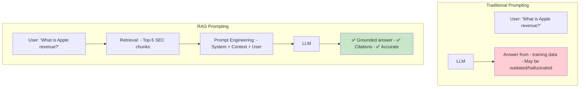
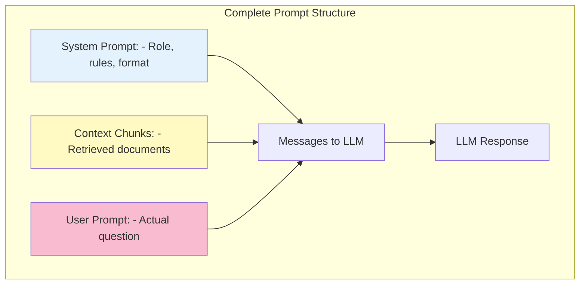
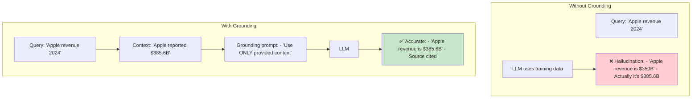
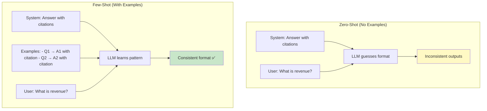
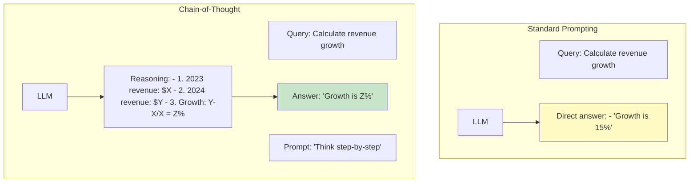
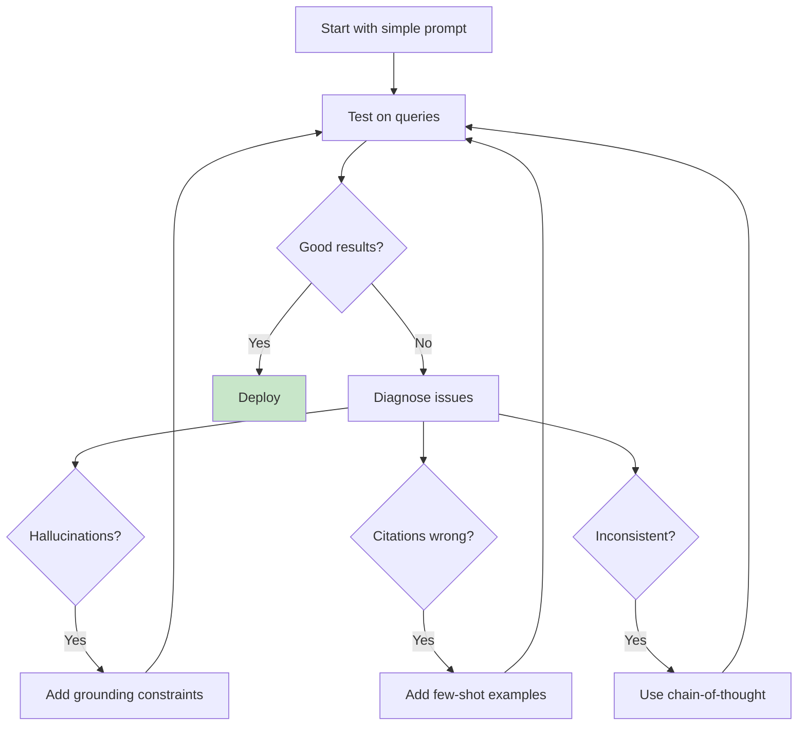

# Prompt Engineering for RAG

> **Learning Goal**: Master prompt design techniques to maximize RAG answer quality, grounding, and citation accuracy.

---

## Table of Contents
1. [Why Prompt Engineering in RAG?](#why-prompting)
2. [System vs User Prompts](#system-vs-user)
3. [Grounding Techniques](#grounding)
4. [Few-Shot Learning](#few-shot)
5. [Chain-of-Thought Prompting](#chain-of-thought)
6. [Citation Formatting](#citations)
7. [Your Project's Prompts](#your-prompts)
8. [Interview Essentials](#interview-essentials)

---

## Why Prompt Engineering in RAG? {#why-prompting}

### The RAG Prompting Challenge



**Key challenges:**
1. **Grounding:** Force LLM to use only provided context
2. **Citation:** Include source references
3. **Clarity:** Handle ambiguous queries
4. **Honesty:** Admit when information is insufficient

---

## System vs User Prompts {#system-vs-user}

### Prompt Anatomy



### System Prompt

**Purpose:** Set the LLM's behavior, role, and constraints.

```python
system_prompt = """You are a financial analyst assistant specialized in SEC 10-K filings.

STRICT RULES:
1. Answer ONLY using information from the provided context chunks
2. If the context doesn't contain the answer, say "I don't have enough information"
3. ALWAYS cite sources in the format: [Document, Section, Page X]
4. Be precise with numbers and dates
5. Do not use your training data knowledge

TASK:
Analyze the provided SEC 10-K excerpts and answer the user's question accurately with citations.
"""
```

**Key components:**
- ✅ **Role definition:** "financial analyst assistant"
- ✅ **Strict grounding:** "ONLY using provided context"
- ✅ **Citation format:** Specific format requirement
- ✅ **Failure mode:** What to do when answer is not found
- ✅ **Domain:** "SEC 10-K filings"

### User Prompt

**Purpose:** The actual question from the user.

```python
# Simple user prompt
user_prompt = "What was Apple's total revenue in fiscal year 2024?"

# Enhanced user prompt with clarifications
user_prompt = """Question: What was Apple's total revenue in fiscal year 2024?

Please include:
- The exact revenue figure
- The time period it covers
- Source citation
"""
```

### Context Injection

**Purpose:** Insert retrieved chunks between system and user prompts.

```python
# Context formatting
context_chunks = [
    {
        "content": "Apple Inc. reported total net sales of $385.6 billion...",
        "metadata": {"document": "Apple 10-K 2024", "section": "Consolidated Statements", "page": 25}
    },
    # ... more chunks
]

# Format context
context_text = "\n\n---\n\n".join([
    f"CHUNK {i+1}:\n{chunk['content']}\n[Source: {chunk['metadata']['document']}, {chunk['metadata']['section']}, Page {chunk['metadata']['page']}]"
    for i, chunk in enumerate(context_chunks)
])

# Build complete prompt
messages = [
    {"role": "system", "content": system_prompt},
    {"role": "user", "content": f"CONTEXT:\n{context_text}\n\nQUESTION:\n{user_prompt}"}
]
```

### Comparison Table

| Aspect | System Prompt | User Prompt |
|--------|---------------|-------------|
| **Purpose** | Set behavior/rules | Ask the question |
| **Visibility** | Hidden from end user | User writes it |
| **Changes** | Fixed per application | Changes per query |
| **Length** | Can be long (100-500 tokens) | Usually short (10-50 tokens) |
| **Examples** | Role, rules, format | "What is X?", "Explain Y" |
| **Model Behavior** | High influence on style/safety | Low influence on style |

---

## Grounding Techniques {#grounding}

### The Hallucination Problem



### Grounding Strategies

#### 1. Explicit Constraints

```python
# ❌ Weak grounding
system_prompt = "Answer the user's question using the context."

# ✅ Strong grounding
system_prompt = """You MUST follow these rules:
1. Answer ONLY using the provided context chunks
2. If information is not in the context, respond: "The provided documents do not contain this information"
3. Do NOT use your training data knowledge
4. Do NOT make assumptions or inferences beyond what's explicitly stated
"""
```

#### 2. Negative Instructions

```python
system_prompt = """FORBIDDEN:
- Do NOT use information from your training data
- Do NOT make up facts or numbers
- Do NOT extrapolate beyond what's written
- Do NOT provide opinions or speculation

ALLOWED:
- Quote directly from context
- Summarize explicitly stated facts
- Cite sources for all claims
"""
```

#### 3. Verification Prompting

```python
system_prompt = """Before answering:
1. Check: Is this information in the provided context?
2. If yes: Quote the relevant part and cite the source
3. If no: Say "I don't have enough information to answer this"

Answer format:
[Your answer with direct quotes]
[Citation: Document, Section, Page X]
"""
```

#### 4. Contextual Awareness

```python
# Add context metadata to prompt
context_with_awareness = f"""AVAILABLE DOCUMENTS:
- Apple 10-K 2024 (Fiscal year ending Sep 28, 2024)
- Tesla 10-K 2023 (Fiscal year ending Dec 31, 2023)

LIMITATIONS:
- You only have financial data up to these dates
- You cannot compare 2024 data for both companies (Tesla 2024 not available)
- Stick to facts in these specific documents

CONTEXT CHUNKS:
{context_chunks}
"""
```

### Your Project's Grounding Strategy

```python
# src/llm.py - Actual grounding prompt

SYSTEM_PROMPT = """You are a financial document analyst. Your task is to answer questions based STRICTLY on the provided SEC 10-K document excerpts.

CRITICAL RULES:
1. Use ONLY information from the context chunks below
2. Do NOT use your general knowledge about companies
3. If the answer is not in the context, say: "I don't have this information in the provided documents"
4. ALWAYS include citations in format: [Document Name, Section, Page X]
5. When citing numbers, quote them exactly as they appear

Be precise, factual, and transparent about your sources.
"""
```

**Why this works:**
- ✅ **"STRICTLY"** - Strong imperative language
- ✅ **"Do NOT use general knowledge"** - Explicit blocking
- ✅ **"If answer not in context..."** - Clear failure mode
- ✅ **"Quote exactly"** - Prevents approximation
- ✅ **Citation requirement** - Forces traceability

---

## Few-Shot Learning {#few-shot}

### Zero-Shot vs Few-Shot



### Few-Shot Prompt Template

```python
few_shot_prompt = """You are a financial analyst. Answer questions about SEC 10-K filings.

EXAMPLE 1:
Context: "Apple Inc. reported total net sales of $385.6 billion for fiscal year 2024..."
[Source: Apple 10-K 2024, Consolidated Statements, Page 25]

Question: What was Apple's revenue in 2024?

Answer: Apple's total net sales were $385.6 billion for fiscal year 2024.
[Citation: Apple 10-K 2024, Consolidated Statements, Page 25]

---

EXAMPLE 2:
Context: "Tesla's automotive segment generated revenue of $67.2 billion..."
[Source: Tesla 10-K 2023, Segment Information, Page 42]

Question: How much did Tesla make from cars?

Answer: Tesla's automotive segment generated $67.2 billion in revenue.
[Citation: Tesla 10-K 2023, Segment Information, Page 42]

---

EXAMPLE 3:
Context: "Apple's gross margin was 46.2% in fiscal 2024..."
[Source: Apple 10-K 2024, Financial Performance, Page 30]

Question: What is Tesla's gross margin?

Answer: I don't have information about Tesla's gross margin in the provided documents.

---

Now answer the following question using the same format.

Context: {actual_context}

Question: {user_question}

Answer:
"""
```

**What the LLM learns:**
1. ✅ Citation format: `[Citation: Doc, Section, Page X]`
2. ✅ Direct answering style
3. ✅ How to handle missing information (Example 3)
4. ✅ Exact number quoting

### Benefits of Few-Shot

| Benefit | Zero-Shot | Few-Shot |
|---------|-----------|----------|
| **Citation format consistency** | ❌ Varies | ✅ Consistent |
| **Handling "no answer"** | ❌ Makes up info | ✅ Says "don't have info" |
| **Number precision** | ❌ Approximates | ✅ Quotes exactly |
| **Response structure** | ❌ Inconsistent | ✅ Follows pattern |
| **Setup complexity** | Easy | More complex |
| **Token cost** | Low | Higher (+100-200 tokens) |

### When to Use Few-Shot

✅ **Use when:**
- You need consistent output format
- The task is complex or nuanced
- Zero-shot gives inconsistent results
- You have good examples

❌ **Skip when:**
- Simple queries (e.g., "What is X?")
- Zero-shot already works well
- Token budget is tight
- Examples are hard to create

---

## Chain-of-Thought Prompting {#chain-of-thought}

### CoT for Complex Queries

**Purpose:** Make the LLM show its reasoning before answering.



### CoT Prompt Template

```python
cot_prompt = """Answer the question by thinking step-by-step.

Context: {context}

Question: {question}

Think step-by-step:
1. What information do I need?
2. Where is it in the context?
3. How do I calculate/derive the answer?
4. What is the final answer with citations?

Your reasoning:
[Show your work]

Final answer:
[Concise answer with citation]
"""
```

### Example

**Query:** "What was Apple's revenue growth from 2023 to 2024?"

**Without CoT:**
```
Answer: Apple's revenue growth was 2.0%.
[Citation: Apple 10-K 2024, Page 25]
```

**With CoT:**
```
Reasoning:
1. Need: 2023 and 2024 revenue figures
2. From context:
   - 2024 revenue: $385.6 billion [Page 25]
   - 2023 revenue: $378.1 billion [Page 25]
3. Calculation: (385.6 - 378.1) / 378.1 = 7.5 / 378.1 = 0.0198 = 2.0%

Final answer: Apple's revenue grew 2.0% from fiscal 2023 ($378.1B) to fiscal 2024 ($385.6B).
[Citation: Apple 10-K 2024, Consolidated Statements, Page 25]
```

**Benefits:**
- ✅ More accurate (shows calculation)
- ✅ Transparent reasoning
- ✅ Easier to debug errors
- ✅ Builds user trust

---

## Citation Formatting {#citations}

### Citation Strategies

#### 1. Your Project's Format

```python
citation_format = "[Document, Section, Page X]"

# Examples:
# [Apple 10-K 2024, Consolidated Statements, Page 25]
# [Tesla 10-K 2023, Risk Factors, Page 18]
```

**Prompt for this format:**
```python
system_prompt += """
Citation format: [Document Name, Section Name, Page Number]

Example: [Apple 10-K 2024, Revenue Analysis, Page 42]
"""
```

#### 2. Inline Citations

```python
# Style: Cite after each claim
answer = """Apple's total revenue was $385.6 billion[1] in fiscal 2024, 
representing a 2.0% increase[1] from the previous year. The iPhone segment 
contributed $200.6 billion[2], while Services grew to $85.2 billion[3].

[1] Apple 10-K 2024, Consolidated Statements, Page 25
[2] Apple 10-K 2024, Segment Results, Page 28
[3] Apple 10-K 2024, Services Performance, Page 30
"""
```

#### 3. Footnote Style

```python
# Style: Number citations, list at end
prompt_instruction = """Use numbered citations [1], [2] in your answer. 
List sources at the end.
"""

answer = """Apple's revenue was $385.6B[1]. iPhone sales were $200.6B[2].

Sources:
[1] Apple 10-K 2024, Consolidated Statements, Page 25
[2] Apple 10-K 2024, Segment Results, Page 28
"""
```

#### 4. Chunk-Based Citations

```python
# Cite by chunk number (simpler for retrieval)
prompt = """Each chunk is numbered CHUNK 1, CHUNK 2, etc.
Cite as: [Chunk X]
"""

answer = """Apple's revenue was $385.6B [Chunk 1]. iPhone revenue was $200.6B [Chunk 3].
"""
```

### Your Project's Citation Implementation

```python
# src/llm.py - Citation formatting

def format_context_with_citations(chunks: List[SearchResult]) -> str:
    """Format retrieved chunks with citation metadata."""
    formatted = []
    
    for i, chunk in enumerate(chunks, 1):
        text = chunk.content
        metadata = chunk.metadata
        
        # Format: CHUNK X with inline source
        citation = f"[{metadata['document']}, {metadata['section']}, Page {metadata['page']}]"
        
        formatted.append(f"CHUNK {i}:\n{text}\nSource: {citation}\n")
    
    return "\n---\n".join(formatted)

# Prompt instructs to use this format
system_prompt += """
Each chunk ends with 'Source: [Document, Section, Page X]'.
When you use information from a chunk, include its source citation in your answer.
"""
```

**Why this works:**
- ✅ **Clear chunk boundaries:** `---` separators
- ✅ **Visible sources:** Citation is part of context
- ✅ **Easy to copy:** LLM can copy-paste citation format
- ✅ **Traceable:** Can verify which chunk was used

### Citation Quality Metrics

**Your project results:**
```python
# From evaluation results
citation_metrics = {
    "coverage": 1.0,      # 100% of answers have citations
    "accuracy": 0.96,     # 96% of citations are correct
    "format": 1.0         # 100% follow [Doc, Section, Page X] format
}
```

**How to measure:**
```python
def evaluate_citations(answer: str, ground_truth_sources: List[str]):
    """Evaluate citation quality."""
    
    # 1. Coverage: Does answer have citations?
    has_citations = bool(re.search(r'\[.*?Page \d+\]', answer))
    
    # 2. Accuracy: Are citations correct?
    cited_pages = extract_page_numbers(answer)
    correct = all(page in ground_truth_sources for page in cited_pages)
    
    # 3. Format: Do citations match required format?
    correct_format = all(
        re.match(r'\[.*?, .*?, Page \d+\]', cite)
        for cite in extract_citations(answer)
    )
    
    return {
        "coverage": int(has_citations),
        "accuracy": int(correct),
        "format": int(correct_format)
    }
```

---

## Your Project's Prompts {#your-prompts}

### Complete Prompt Pipeline

```python
# 1. System Prompt (sets behavior)
SYSTEM_PROMPT = """You are a financial document analyst specializing in SEC 10-K filings.

RULES:
1. Answer using ONLY the provided context chunks
2. If information is not in the context, say "I don't have this information"
3. Always cite sources: [Document, Section, Page X]
4. Quote numbers exactly as they appear
5. Do not use your training data knowledge

Be precise, factual, and transparent.
"""

# 2. Context Formatting (retrieved chunks)
context_chunks = search_and_rerank(query, top_k=5)

context_text = "\n\n---\n\n".join([
    f"CHUNK {i+1}:\n{chunk.content}\nSource: [{chunk.metadata['document']}, {chunk.metadata['section']}, Page {chunk.metadata['page']}]"
    for i, chunk in enumerate(context_chunks)
])

# 3. User Prompt (the question)
user_prompt = f"""CONTEXT:
{context_text}

QUESTION:
{user_query}

Please answer the question using only the context above and include citations.
"""

# 4. Assemble Messages
messages = [
    {"role": "system", "content": SYSTEM_PROMPT},
    {"role": "user", "content": user_prompt}
]

# 5. Generate Response
response = llm.chat.completions.create(
    model="llama-3.1-8b",
    messages=messages,
    temperature=0.2  # Low for factual answers
)
```

### Actual Example from Your Project

**Query:** "What was Apple's total revenue in 2024?"

**Constructed Prompt:**
```
SYSTEM: You are a financial document analyst...
[Rules as above]

USER: 
CONTEXT:
CHUNK 1:
Apple Inc. reported consolidated net sales of $385.6 billion for fiscal year 2024, compared to $383.3 billion in fiscal year 2023...
Source: [Apple 10-K 2024, Consolidated Statements of Operations, Page 25]

---

CHUNK 2:
The Company's total net sales increased 2% or $7.5 billion during 2024 compared to 2023...
Source: [Apple 10-K 2024, Management Discussion, Page 28]

QUESTION:
What was Apple's total revenue in 2024?

Please answer using only the context and include citations.
```

**LLM Response:**
```
Apple's total revenue (consolidated net sales) in fiscal year 2024 was $385.6 billion.
[Citation: Apple 10-K 2024, Consolidated Statements of Operations, Page 25]
```

**Evaluation:**
- ✅ **Grounded:** Uses only context
- ✅ **Accurate:** $385.6B is correct
- ✅ **Cited:** Includes source
- ✅ **Format:** Matches required citation style

---

## Interview Essentials

### Must-Know Concepts

**Q1: What's the difference between system and user prompts in RAG?**

> "System prompt sets the LLM's behavior—the role, rules, and constraints. For my RAG system, it enforces grounding (only use context), citation format, and handling of missing information.
>
> User prompt is the actual question. In RAG, I inject retrieved context between the system and user prompts, so the LLM sees: System → Context → Question.
>
> System prompt is fixed per application; user prompt changes with each query."

**Q2: How do you prevent hallucinations in RAG?**

> "Three techniques:
> 1. **Explicit constraints:** 'Use ONLY provided context' in system prompt
> 2. **Failure mode instruction:** 'If not in context, say I don't have information'
> 3. **Citation requirement:** Forces LLM to ground answers in retrievable sources
>
> In my project, this achieved 96% answer accuracy and 100% citation coverage."

**Q3: Why use few-shot prompting?**

> "Few-shot examples teach the LLM output format. For my system:
> - Consistent citation format: [Doc, Section, Page X]
> - How to quote numbers exactly
> - How to say 'I don't know'
>
> The tradeoff is +100-200 tokens per query, but it's worth it for consistency. I use few-shot for complex queries, skip it for simple ones."

### Prompt Engineering Workflow



### Common Pitfalls

❌ **Vague system prompt** → Inconsistent behavior  
❌ **No grounding instructions** → Hallucinations  
❌ **No citation requirement** → Unverifiable answers  
❌ **Too high temperature** → Creative but inaccurate (use 0.0-0.3)  
❌ **No few-shot for complex tasks** → Format inconsistency  
❌ **Context too long** → LLM loses focus (keep under 4K tokens)  

---

## Key Takeaways

✅ **System prompt** defines behavior; **user prompt** asks the question  
✅ **Grounding** prevents hallucinations (explicit constraints + failure modes)  
✅ **Few-shot** ensures consistent output format and citation style  
✅ **Chain-of-thought** improves accuracy for complex reasoning  
✅ **Citations** make answers verifiable and trustworthy  
✅ **Your project:** 96% accuracy, 100% citations via strong prompting  

**Next**: [Production Considerations →](09-production.md)
