# Evaluation & Metrics for RAG Systems

> **Learning Goal**: Master RAG evaluation frameworks, metrics, and best practices for measuring system quality.

---

## Table of Contents
1. [Why Evaluation Matters](#why-evaluation)
2. [Retrieval Metrics](#retrieval-metrics)
3. [Generation Metrics](#generation-metrics)
4. [RAGAS Framework](#ragas-framework)
5. [End-to-End Evaluation](#end-to-end)
6. [Your Project's Evaluation](#your-project)
7. [Interview Essentials](#interview-essentials)

---

## Why Evaluation Matters {#why-evaluation}

### The Challenge


### Evaluation Types

| Type | Measures | Speed | Cost | Accuracy |
|------|----------|-------|------|----------|
| **Keyword Match** | Exact overlap | ⚡⚡⚡ Fast | Free | ⚠️ Limited |
| **Semantic Similarity** | Embedding distance | ⚡⚡ Medium | Low | ⭐⭐ Good |
| **LLM-as-Judge** | Criteria-based scoring | ⚡ Slow | $$ | ⭐⭐⭐ Best |
| **Human Evaluation** | Expert review | 🐌 Very slow | $$$ | ⭐⭐⭐⭐ Gold |

---

## Retrieval Metrics {#retrieval-metrics}

### Core Metrics


### Precision

**Definition**: Fraction of retrieved documents that are relevant.

$$
\text{Precision@K} = \frac{\text{Relevant docs in top-K}}{\text{K}}
$$

**Example:**
```
Query: "Apple revenue 2024"
Retrieved 10 docs:
- 7 are relevant to Apple revenue ✅
- 3 are about Apple products ❌

Precision@10 = 7/10 = 0.70
```

### Recall

**Definition**: Fraction of relevant documents that were retrieved.

$$
\text{Recall@K} = \frac{\text{Relevant docs in top-K}}{\text{Total relevant docs}}
$$

**Example:**
```
Total relevant docs in corpus: 12
Retrieved in top-10: 7

Recall@10 = 7/12 = 0.58
```

### Precision-Recall Tradeoff


### Advanced Metrics

#### MRR (Mean Reciprocal Rank)

**Measures**: Position of first relevant result.

$$
\text{MRR} = \frac{1}{|Q|} \sum_{i=1}^{|Q|} \frac{1}{\text{rank}_i}
$$

**Example:**
```
Query 1: First relevant at position 2 → 1/2 = 0.50
Query 2: First relevant at position 1 → 1/1 = 1.00
Query 3: First relevant at position 4 → 1/4 = 0.25

MRR = (0.50 + 1.00 + 0.25) / 3 = 0.58
```

**Use case**: When users typically click the first result.

#### NDCG (Normalized Discounted Cumulative Gain)

**Measures**: Ranking quality with position weighting.

$$
\text{DCG@K} = \sum_{i=1}^{K} \frac{\text{rel}_i}{\log_2(i+1)}
$$

$$
\text{NDCG@K} = \frac{\text{DCG@K}}{\text{IDCG@K}}
$$

**Intuition**: Relevant docs higher in ranking = better score.


**Use case**: When ranking order matters (e.g., search engines).

---

## Generation Metrics {#generation-metrics}

### Factual Correctness

#### Exact Match (EM)

```python
def exact_match(prediction, ground_truth):
    return normalize(prediction) == normalize(ground_truth)

# Example:
prediction = "Apple's revenue was $385.6 billion"
ground_truth = "$385.6B"
# Normalize both → match!
```

**Pros**: Simple, objective  
**Cons**: Too strict, misses paraphrases

#### F1 Token Overlap

```python
def f1_score(prediction, ground_truth):
    pred_tokens = set(normalize(prediction).split())
    true_tokens = set(normalize(ground_truth).split())
    
    if not pred_tokens or not true_tokens:
        return 0.0
    
    common = pred_tokens & true_tokens
    precision = len(common) / len(pred_tokens)
    recall = len(common) / len(true_tokens)
    
    return 2 * precision * recall / (precision + recall)
```

**Example:**
```
Prediction: "revenue was 385.6 billion dollars"
Ground truth: "total revenue $385.6B"

Common tokens: {revenue, 385.6}
F1 = ~0.5
```

### Semantic Similarity

```python
from sentence_transformers import SentenceTransformer
import numpy as np

model = SentenceTransformer('all-MiniLM-L6-v2')

def semantic_similarity(text1, text2):
    emb1 = model.encode([text1])[0]
    emb2 = model.encode([text2])[0]
    
    return np.dot(emb1, emb2)  # Cosine if normalized
```

**Pros**: Handles paraphrases  
**Cons**: May miss factual errors

---

## RAGAS Framework {#ragas-framework}

**RAGAS** = Retrieval Augmented Generation Assessment

### Key Metrics


### 1. Faithfulness (Groundedness)

**Question**: Is the answer supported by the retrieved context?

```python
# RAGAS uses LLM to check:
# 1. Extract claims from answer
# 2. Verify each claim against context
# 3. Score = supported_claims / total_claims

Answer: "Apple's revenue in 2024 was $385.6B, up 2% from 2023"
Context: "... Apple reported revenue of $385.6 billion..."

Claims:
✅ Revenue is $385.6B → Supported
❌ Up 2% from 2023 → Not in context!

Faithfulness = 1/2 = 0.5
```

### 2. Answer Relevance

**Question**: Does the answer address the user's question?

```python
# RAGAS approach:
# 1. Generate reverse questions from the answer
# 2. Compare with original question
# 3. High similarity = high relevance

Question: "What was Apple's 2024 revenue?"
Answer: "Apple reported $385.6B revenue in fiscal 2024"

Generated reverse: "What was Apple's revenue in 2024?" 
Similarity: 0.95 ✅

Answer: "Apple is a technology company based in Cupertino"
Generated reverse: "Where is Apple based?"
Similarity: 0.3 ❌
```

### 3. Context Precision

**Question**: How many retrieved chunks are actually useful?

$$
\text{Context Precision@K} = \frac{\text{Relevant chunks}}{\text{K}}
$$

### 4. Context Recall

**Question**: Does context cover all info needed to answer?

**Evaluation:**
```python
# RAGAS uses ground_truth answer
# Checks if context contains all facts from ground_truth

Ground truth: "$385.6B revenue, 2% increase"
Context: 
- Chunk 1: "...revenue of $385.6B..."  ✅
- Chunk 2: "...iPhone sales strong..." ❌ (not needed)
- Chunk 3: (missing 2% increase info) ❌

Context Recall = 1/2 = 0.5
```

### RAGAS Implementation

```python
from ragas import evaluate
from ragas.metrics import faithfulness, answer_relevancy

# Your test dataset
dataset = {
    "question": ["What was Apple's revenue?"],
    "answer": ["$385.6 billion"],
    "contexts": [["Apple reported revenue of $385.6B in 2024"]],
    "ground_truth": ["$385.6 billion"]
}

# Evaluate
result = evaluate(
    dataset,
    metrics=[faithfulness, answer_relevancy, context_recall, context_precision]
)

print(result)
# {
#   'faithfulness': 0.95,
#   'answer_relevancy': 0.92,
#   'context_recall': 0.88,
#   'context_precision': 0.75
# }
```

---

## End-to-End Evaluation {#end-to-end}

### Evaluation Pipeline


### Your Project's Test Dataset

```python
# 13 questions from assignment
TEST_QUESTIONS = [
    {
        "id": 1,
        "question": "What was Apple's total revenue for fiscal year 2024?",
        "ground_truth": "$385.6 billion",
        "category": "factual",
        "difficulty": "easy"
    },
    {
        "id": 11,
        "question": "What is Tesla's stock price forecast for 2025?",
        "ground_truth": "refuse_out_of_scope",
        "category": "out_of_scope",
        "difficulty": "hard"
    },
    # ... more questions
]
```

### Automated Evaluation

```python
# src/test/evaluate.py - Simplified

def evaluate_rag_system(pipeline, test_questions):
    results = []
    
    for item in test_questions:
        # Generate answer
        response = pipeline.answer_question(item['question'])
        
        # Extract sources
        sources = response['sources']
        
        # Check if answer contains key facts
        ground_truth = item['ground_truth']
        
        if ground_truth == "refuse_out_of_scope":
            # Check if system refused
            is_correct = "cannot answer" in response['answer'].lower()
        else:
            # Check factual accuracy
            is_correct = ground_truth.lower() in response['answer'].lower()
        
        # Check citations
        has_citations = len(sources) > 0
        
        results.append({
            "question_id": item['id'],
            "answer": response['answer'],
            "sources": sources,
            "is_correct": is_correct,
            "has_citations": has_citations
        })
    
    # Aggregate metrics
    accuracy = sum(r['is_correct'] for r in results) / len(results)
    citation_rate = sum(r['has_citations'] for r in results) / len(results)
    
    return {
        "accuracy": accuracy,
        "citation_rate": citation_rate,
        "results": results
    }
```

---

## Your Project's Evaluation {#your-project}

### Metrics Tracked

```python
# From outputs/EVALUATION_SUMMARY.md

Metrics:
├── Accuracy: 92% (12/13 correct)
├── Citation Rate: 100% (all answers cite sources)
├── Average Response Time: 3.2s
├── Retrieval Precision@5: 0.85
└── Out-of-Scope Detection: 100% (3/3 refused)
```

### Evaluation Outputs

```
outputs/
├── evaluation_results_*.json         # Individual runs
├── evaluation_comparison_report.json # Compare configs
├── evaluation_comparison_report.html # Visual report
└── EVALUATION_SUMMARY.md             # Human-readable summary
```

### Comparison Across Configurations

```mermaid
graph LR
    subgraph "A/B Testing Different Configs"
        C1[Config 1:<br/>top_k=10, no rerank] --> R1[Accuracy: 77%]
        C2[Config 2:<br/>top_k=15, with rerank] --> R2[Accuracy: 92% ✅]
        C3[Config 3:<br/>vector-only] --> R3[Accuracy: 69%]
    end
    
    style R2 fill:#c8e6c9
```



---

## Interview Essentials

### Must-Know Concepts

**Q1: How do you evaluate a RAG system?**

> "RAG evaluation has two components: retrieval and generation. For retrieval, I measure Precision@K, Recall@K, and NDCG. For generation, I use faithfulness (grounding in context), answer relevance, and factual accuracy. I also track end-to-end metrics like latency and cost."

**Q2: What is RAGAS?**

> "RAGAS is an LLM-based evaluation framework specifically for RAG systems. It measures four key aspects: faithfulness (answer grounded in context), answer relevance (addresses the question), context precision (useful chunks), and context recall (complete information). It uses LLMs as judges to score these automatically."

**Q3: Explain your project's evaluation strategy.**


### Common Pitfalls

❌ **Only measuring accuracy** → Miss latency, cost, user experience  
❌ **Small test set** → Not statistically significant  
❌ **No out-of-scope tests** → System hallucinates on unanswerable questions  
❌ **Exact match only** → Miss correct paraphrases  
❌ **No A/B testing** → Can't prove optimizations help  

---

## Key Takeaways

✅ **Evaluate both retrieval and generation** separately  
✅ **Use multiple metrics**: Precision, Recall, Faithfulness, Relevance  
✅ **RAGAS provides LLM-based evaluation** for RAG systems  
✅ **A/B test different configurations** to optimize  
✅ **Track end-to-end metrics**: Accuracy, latency, cost  

**Next**: [Advanced RAG Techniques →](08-advanced-rag.md)
