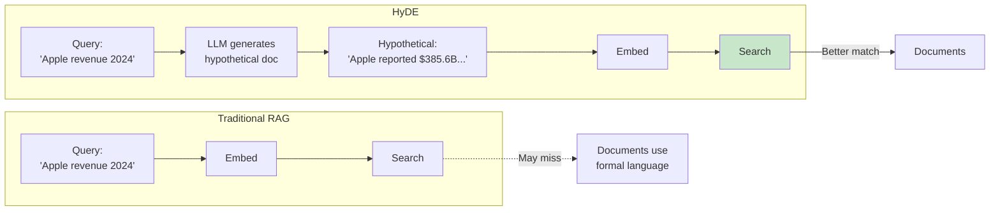
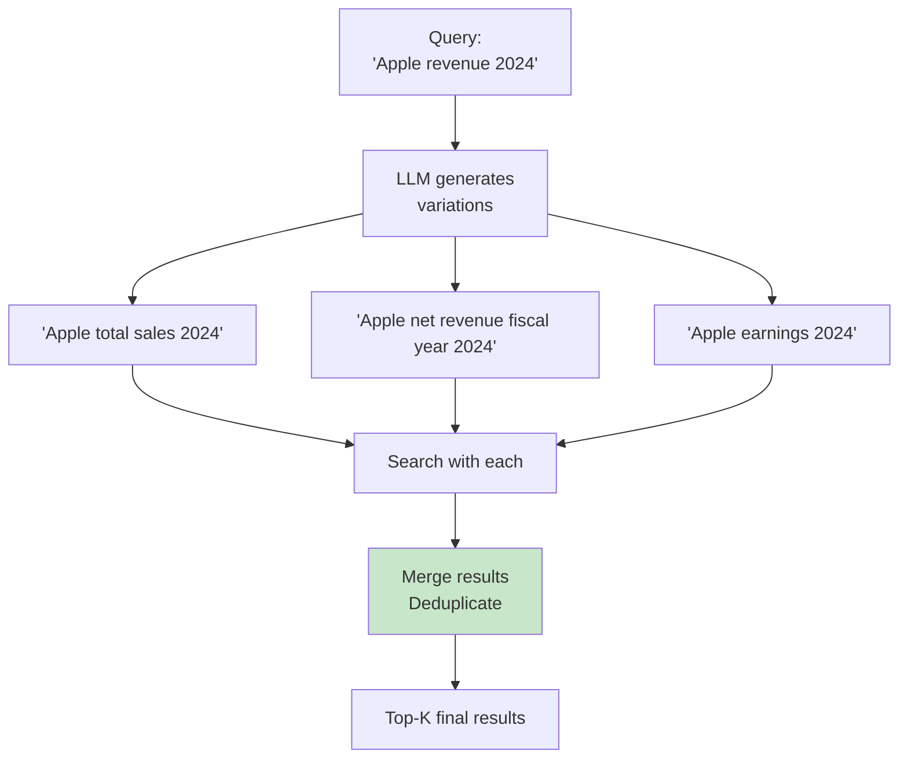
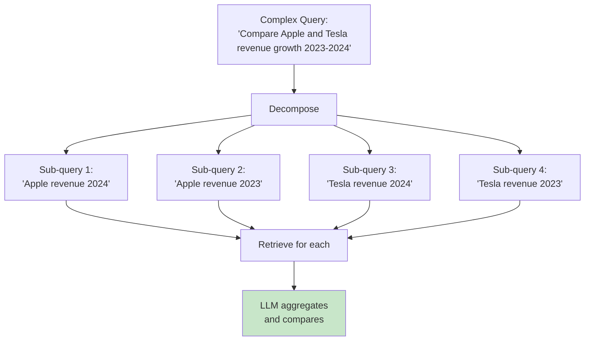
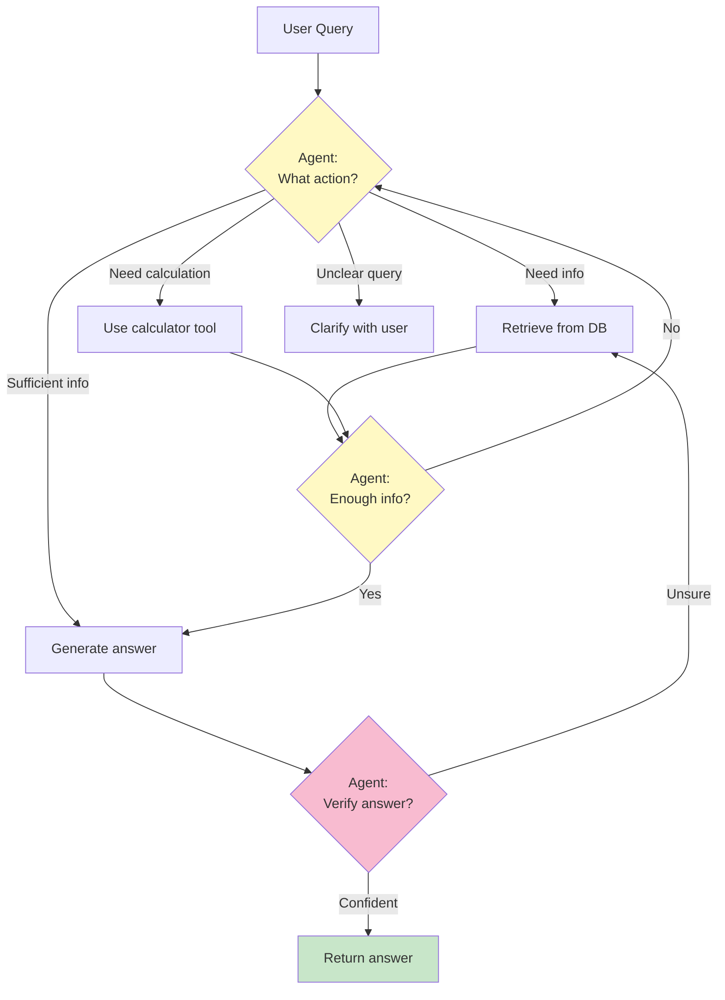
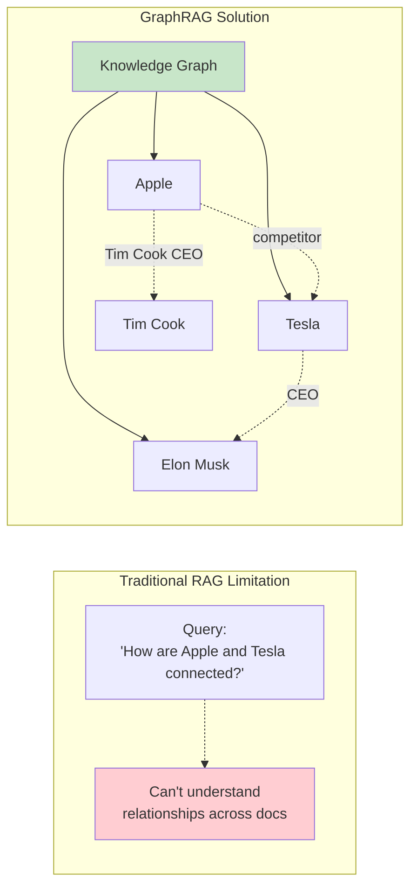
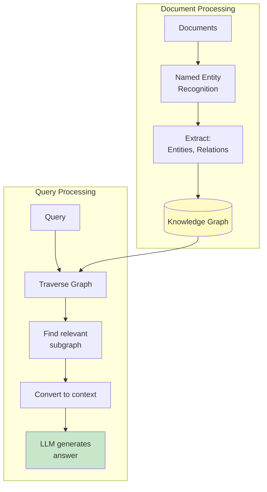
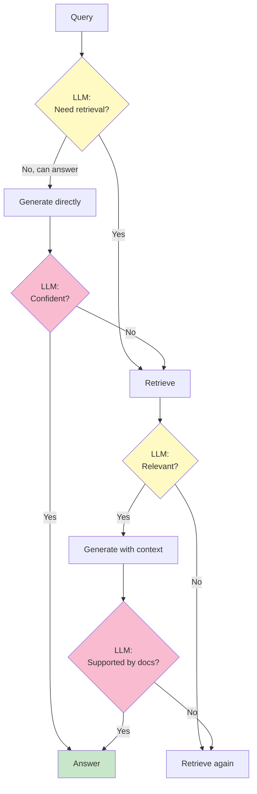
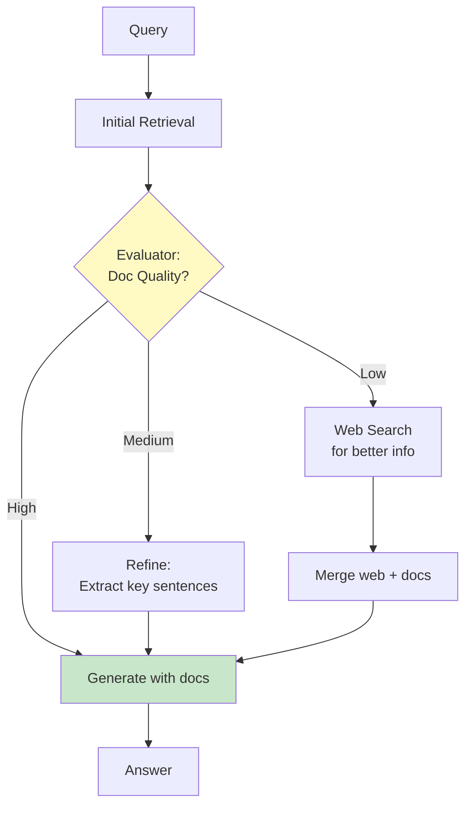
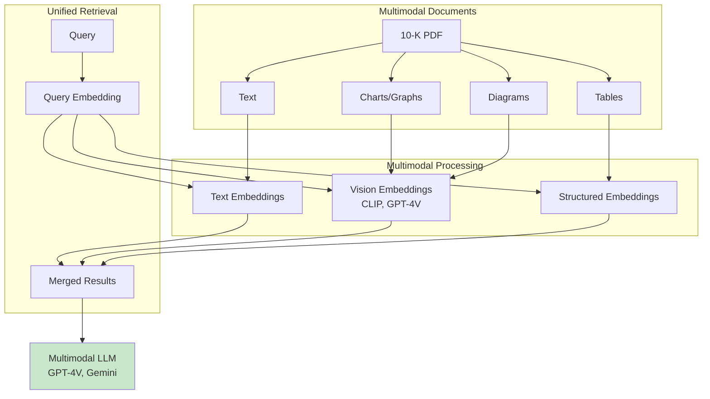
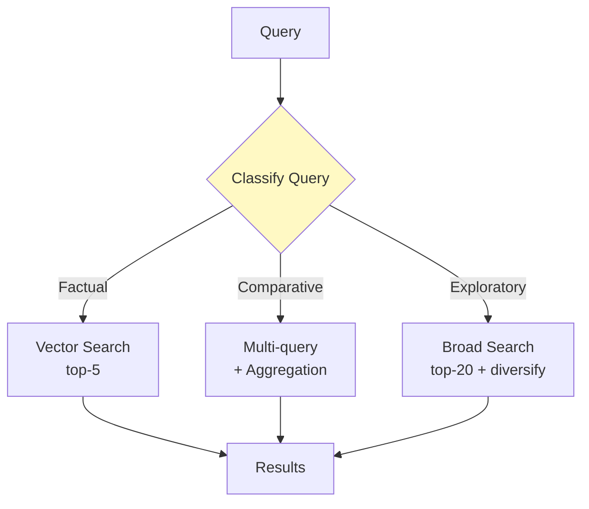

# Advanced RAG Techniques (2025-2026)

> **Learning Goal**: Master cutting-edge RAG patterns and understand state-of-the-art approaches.

---

## Table of Contents
1. [Query Enhancement](#query-enhancement)
2. [Agentic RAG](#agentic-rag)
3. [GraphRAG](#graphrag)
4. [Self-RAG & Corrective RAG](#self-rag)
5. [Multimodal RAG](#multimodal)
6. [Production Patterns](#production-patterns)
7. [Interview Essentials](#interview-essentials)

---

## Query Enhancement {#query-enhancement}

### HyDE (Hypothetical Document Embeddings)

**Problem**: Queries and documents live in different embedding spaces.

**Solution**: Generate a hypothetical answer, embed that instead!



**Implementation:**
```python
def hyde_search(query, llm, vector_store):
    # 1. Generate hypothetical document
    prompt = f"Generate a passage that answers: {query}"
    hypothetical_doc = llm.generate(prompt)
    
    # 2. Embed and search with hypothetical doc
    results = vector_store.search(hypothetical_doc)
    
    return results

# Example:
query = "What was Apple's revenue growth?"
hypothetical = "Apple's revenue grew by 2.1% to $385.6 billion in fiscal 2024..."
# This matches better with formal SEC language!
```

**When to use:**
- ✅ Short queries (1-3 words)
- ✅ Domain-specific terminology mismatch
- ⚠️ Adds LLM call latency

### Multi-Query Expansion

**Idea**: Generate multiple paraphrases of the query for better coverage.



**Implementation:**
```python
def multi_query_search(query, llm, vector_store, n_variants=3):
    # Generate query variants
    prompt = f"""Generate {n_variants} alternative phrasings of:
    {query}
    
    Variants:"""
    
    variants = llm.generate(prompt).split('\n')[:n_variants]
    variants.append(query)  # Include original
    
    # Search with all variants
    all_results = []
    for variant in variants:
        results = vector_store.search(variant, k=10)
        all_results.extend(results)
    
    # Deduplicate and rank
    return deduplicate_and_rank(all_results)
```

### Query Decomposition

**For complex queries**: Break into sub-queries.



---

## Agentic RAG {#agentic-rag}

### What is Agentic RAG?

**Traditional RAG**: Linear pipeline (retrieve → generate)  
**Agentic RAG**: LLM decides what to do next



### ReAct Pattern (Reasoning + Acting)

```python
class AgenticRAG:
    def answer(self, query):
        thought_action_history = []
        max_iterations = 5
        
        for i in range(max_iterations):
            # Thought: What do I need to do?
            thought = self.llm.think(query, thought_action_history)
            
            if "ANSWER" in thought:
                # Ready to answer
                return self.llm.generate_final_answer(thought_action_history)
            
            # Action: Execute tool
            if "SEARCH" in thought:
                action_result = self.vector_store.search(query)
            elif "CALCULATE" in thought:
                action_result = self.calculator.compute(...)
            
            thought_action_history.append({
                "thought": thought,
                "action": action_result
            })
        
        return "Could not find answer after 5 iterations"

# Example execution:
# Thought 1: "I need to search for Apple's 2024 revenue"
# Action 1: Search → Found "$385.6B"
# Thought 2: "I need to search for Apple's 2023 revenue to compare"
# Action 2: Search → Found "$383.3B"
# Thought 3: "I can now calculate growth and answer"
# Action 3: ANSWER
```

### Tool Use / Function Calling

```python
tools = [
    {
        "name": "vector_search",
        "description": "Search financial documents",
        "parameters": {"query": "string", "k": "int"}
    },
    {
        "name": "calculator",
        "description": "Perform calculations",
        "parameters": {"expression": "string"}
    },
    {
        "name": "web_search",
        "description": "Search current web info",
        "parameters": {"query": "string"}
    }
]

# LLM decides which tool to use
llm_response = llm.generate_with_tools(query, tools)

if llm_response.tool == "vector_search":
    result = vector_search(**llm_response.tool_args)
elif llm_response.tool == "calculator":
    result = calculator(**llm_response.tool_args)
```

---

## GraphRAG {#graphrag}

### The Problem with Traditional RAG



### GraphRAG Architecture



### When to Use GraphRAG

| Use Case | Traditional RAG | GraphRAG |
|----------|----------------|----------|
| **Simple facts** | ✅ Good | ⚠️ Overkill |
| **Multi-hop reasoning** | ❌ Struggles | ✅ Excellent |
| **Relationship queries** | ❌ Poor | ✅ Excellent |
| **Summarization** | ✅ Good | ✅ Good |
| **Setup complexity** | ✅ Simple | ❌ Complex |

**Example queries GraphRAG excels at:**
- "What companies did Elon Musk mention in Tesla's 10-K?"
- "How many layers of suppliers does Apple have?"
- "What partnerships exist between these companies?"

---

## Self-RAG & Corrective RAG {#self-rag}

### Self-RAG: Self-Reflective Retrieval

**Idea**: LLM decides when to retrieve and critiques its own outputs.



**Self-RAG Tokens:**
```
Query: "What was Apple's revenue?"

LLM: [Retrieve] Yes, need external info
→ Retrieves documents

LLM: [IsRel] Yes, relevant documents
→ Proceeds with generation

LLM: [IsSup] Yes, supported by context
→ "Apple's revenue was $385.6B"

LLM: [IsUse] Yes, useful answer
→ Returns to user
```

### Corrective RAG (CRAG)

**Idea**: Evaluate and correct retrieval before generation.



**Implementation:**
```python
def corrective_rag(query, vector_store, web_search):
    # 1. Initial retrieval
    docs = vector_store.search(query, k=5)
    
    # 2. Evaluate relevance
    relevance_scores = evaluate_relevance(query, docs)
    
    if max(relevance_scores) > 0.8:
        # High quality → use as-is
        context = docs
    elif max(relevance_scores) > 0.5:
        # Medium → refine
        context = extract_key_sentences(query, docs)
    else:
        # Low → supplement with web search
        web_results = web_search(query)
        context = merge(docs, web_results)
    
    # 3. Generate with corrected context
    return llm.generate(query, context)
```

---

## Multimodal RAG {#multimodal}

### Beyond Text



### Use Cases

**Financial Reports:**
- Extract data from revenue charts
- Understand organizational diagrams
- Parse complex tables

**Implementation (2026):**
```python
from transformers import CLIPModel

# Embed images
clip = CLIPModel.from_pretrained("openai/clip-vit-base-patch32")
image_embedding = clip.encode_image(chart_image)

# Embed text query
query_embedding = embedder.embed("revenue growth chart")

# Search across modalities
combined_search(query_embedding, text_index, image_index)
```

---

## Production Patterns {#production-patterns}

### Adaptive Retrieval

**Idea**: Adjust retrieval strategy based on query type.



### Caching Strategies

```python
from functools import lru_cache
import hashlib

class CachedRAG:
    def __init__(self):
        self.cache = {}
    
    def answer(self, query):
        # Hash query for cache key
        cache_key = hashlib.md5(query.encode()).hexdigest()
        
        if cache_key in self.cache:
            return self.cache[cache_key]  # 100x faster!
        
        # Compute answer
        answer = self.rag_pipeline(query)
        self.cache[cache_key] = answer
        
        return answer
```

**Cache hit rates in production:**
- Financial Q&A: ~30-40% (many repeated questions)
- Customer support: ~50-60% (common issues)
- Your project: Could cache evaluation queries

### Streaming Responses

```python
async def stream_rag_response(query):
    # 1. Retrieve (blocking)
    docs = await retrieve(query)
    
    # 2. Stream generation
    async for chunk in llm.stream_generate(query, docs):
        yield chunk
    
    # 3. Stream citations after answer
    yield "\n\nSources:\n"
    for doc in docs:
        yield f"- {doc.source}\n"

# User sees answer build up in real-time!
```

---

## Interview Essentials

### Technique Comparison

| Technique | Complexity | Performance Gain | When to Use |
|-----------|------------|------------------|-------------|
| **HyDE** | Low | +5-10% recall | Short queries, domain mismatch |
| **Multi-Query** | Low | +10-15% recall | Ambiguous queries |
| **Agentic RAG** | High | +20-30% on complex | Multi-step reasoning |
| **GraphRAG** | Very High | +40% on relationships | Entity-heavy, connections |
| **Self-RAG** | Medium | +15% accuracy | Quality-critical apps |
| **CRAG** | Medium | +10-20% accuracy | Noisy retrieval |

### Discussion Points

**Q: "How would you improve your current RAG system?"**

> "I'd add three things:
> 1. **HyDE for short queries** → generate hypothetical docs
> 2. **Query decomposition** → handle complex multi-part questions
> 3. **CRAG-style evaluation** → validate retrieval quality before generation
> 
> I'd measure impact with A/B tests on our 13-question eval set."

**Q: "Explain Self-RAG vs Corrective RAG"**

| Aspect | Self-RAG | Corrective RAG |
|--------|----------|----------------|
| **Focus** | LLM self-reflection | Document quality |
| **Decision point** | Before & after retrieval | After retrieval only |
| **Fallback** | Re-retrieve or direct answer | Web search supplement |
| **Complexity** | Higher (needs special tokens) | Medium |

**Q: "When would you use GraphRAG?"**

> "GraphRAG excels at:
> - Multi-hop reasoning ('Who are Apple's suppliers' suppliers?')
> - Relationship queries ('How are these companies connected?')
> - Entity-centric analysis
> 
> But it requires:
> - Entity extraction pipeline
> - Graph database (Neo4j)
> - 2-3x more complex setup
> 
> For simple factual Q&A like my 10-K project, traditional RAG is sufficient."

---

## Key Takeaways

✅ **Query enhancement** (HyDE, multi-query) improves recall  
✅ **Agentic RAG** enables multi-step reasoning and tool use  
✅ **GraphRAG** excels at relationship and multi-hop queries  
✅ **Self-RAG & CRAG** add quality control through self-reflection  
✅ **Multimodal RAG** handles images, tables, and diagrams  

**Next**: [Interview Preparation →](10-interview-prep.md)
