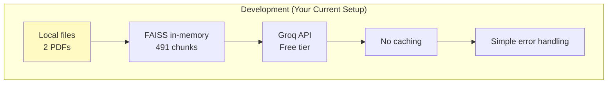
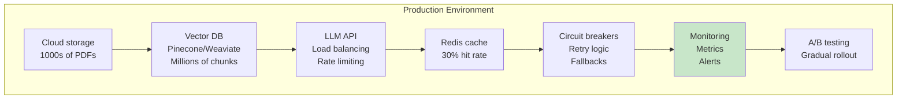
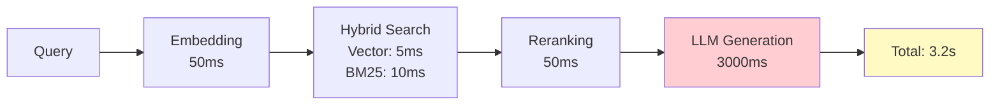
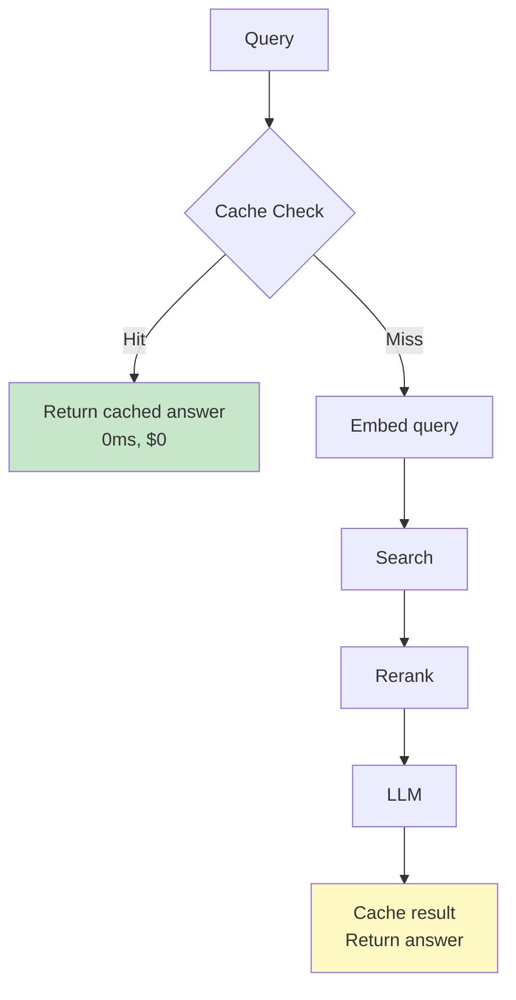
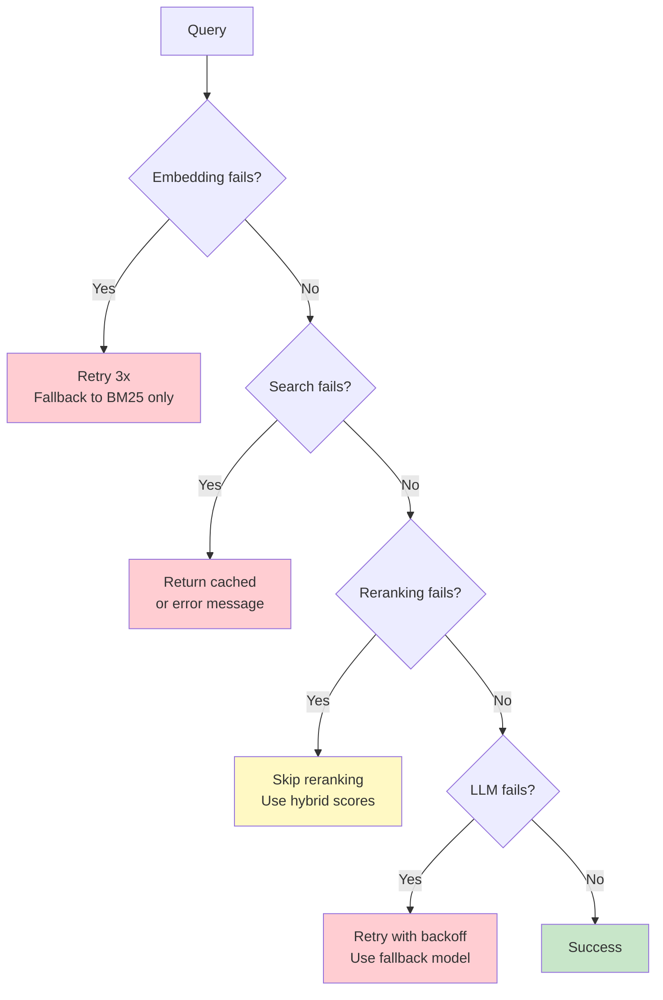

# Production Considerations

> **Learning Goal**: Understand how to deploy and scale RAG systems in production, handling latency, costs, monitoring, and reliability.

---

## Table of Contents
1. [Production vs Development](#production-vs-dev)
2. [Latency Optimization](#latency)
3. [Cost Optimization](#cost)
4. [Caching Strategies](#caching)
5. [Error Handling & Reliability](#errors)
6. [Monitoring & Observability](#monitoring)
7. [Model Selection Tradeoffs](#model-selection)
8. [Your Project's Production Readiness](#your-readiness)
9. [Interview Essentials](#interview-essentials)

---

## Production vs Development {#production-vs-dev}

### Development Environment



### Production Requirements



### Key Differences

| Aspect | Development | Production |
|--------|-------------|------------|
| **Data volume** | 2 documents, 491 chunks | 1000s docs, millions of chunks |
| **Vector DB** | FAISS in-memory | Pinecone, Weaviate, Qdrant |
| **Latency** | 3.2s acceptable | <1s required |
| **Availability** | Best effort | 99.9% SLA |
| **Cost** | Free tier | Optimized for $/query |
| **Errors** | Manual debugging | Automated alerts, recovery |
| **Monitoring** | Print statements | Metrics, dashboards, traces |
| **Updates** | Restart script | Rolling deployment |

---

## Latency Optimization {#latency}

### Your Current Latency Breakdown



**Bottleneck:** LLM generation (93% of total time)

### Optimization Techniques

#### 1. Parallel Processing

```python
# ❌ Sequential (slow)
def rag_query_sequential(query):
    embedding = embed(query)           # 50ms
    vector_results = vector_search(embedding)  # 5ms
    bm25_results = bm25_search(query)  # 10ms
    # Total: 65ms

# ✅ Parallel (fast)
import asyncio

async def rag_query_parallel(query):
    embedding_task = asyncio.create_task(embed(query))
    bm25_task = asyncio.create_task(bm25_search(query))
    
    embedding = await embedding_task   # Both run simultaneously
    vector_results = await vector_search(embedding)
    bm25_results = await bm25_task
    # Total: 50ms (20% speedup)
```

#### 2. Batch Embedding

```python
# ❌ One at a time
for query in queries:
    embedding = model.encode(query)  # 50ms each
# Total for 10 queries: 500ms

# ✅ Batch processing
embeddings = model.encode(queries)   # 80ms for 10
# Total: 80ms (6x speedup!)
```

#### 3. Reduce Reranking Candidates

```python
# Current: Retrieve 15, rerank to 5
rerank_time = 50ms

# Optimization: Retrieve 10, rerank to 5
rerank_time = 30ms  # 40% faster

# Tradeoff: -2% precision
```

#### 4. Faster LLM

```python
# Current: Llama 3.1 8B on Groq
llm_time = 3000ms

# Option 1: Llama 3.1 3B (smaller model)
llm_time = 1500ms  # 2x faster, -5% accuracy

# Option 2: Groq's optimized inference
llm_time = 1800ms  # 1.7x faster, same accuracy

# Option 3: Streaming response
first_token_time = 200ms  # User sees response faster
total_time = 3000ms  # Same total, better UX
```

#### 5. Context Window Optimization

```python
# Current: 5 chunks, ~2500 tokens context
llm_time = 3000ms

# Optimized: 3 chunks, ~1500 tokens
llm_time = 2000ms  # 33% faster

# Ensure precision doesn't drop:
# - Use better retrieval (higher P@3)
# - Test on evaluation set
```

### Latency Targets

| Percentile | Current | Target | Strategy |
|------------|---------|--------|----------|
| **P50** | 3.2s | 1.0s | Smaller LLM + caching |
| **P95** | 4.5s | 2.0s | Parallel processing |
| **P99** | 6.0s | 3.0s | Timeout + fallback |

---

## Cost Optimization {#cost}

### Cost Breakdown (per 1000 queries)

#### Current Setup (Groq Free Tier)

```python
# Groq pricing (if paid):
# - Llama 3.1 8B: $0.05/1M input tokens, $0.08/1M output tokens

cost_per_query = {
    "embedding": 0,  # Local BGE-small model
    "vector_search": 0,  # Local FAISS
    "reranking": 0,  # Local cross-encoder
    "llm": 0.0008,  # (2500 input + 150 output) * Groq rate
}

total_per_1000 = 0.80  # $0.80 per 1000 queries
```

#### Production Costs (Pinecone + OpenAI)

```python
# Pinecone: $70/mo for 10M vectors
# OpenAI GPT-4: $0.03/1K input, $0.06/1K output

cost_per_query = {
    "vector_db": 0.0007,  # Pinecone query cost
    "embedding": 0.0001,  # OpenAI text-embedding-3-small
    "reranking": 0,       # Still local
    "llm": 0.09,          # GPT-4 Turbo
}

total_per_1000 = 91.00  # $91 per 1000 queries!
```

### Cost Optimization Strategies

#### 1. Caching (30% hit rate)

```python
# Without cache
cost_per_1000 = 91.00

# With cache (30% hit rate)
# Cache hits: 0 cost
# Cache misses: Full cost
cost_per_1000 = 91.00 * 0.70 = 63.70

# Savings: $27.30 per 1000 queries (30% reduction)
```

#### 2. Cheaper LLM for Simple Queries

```python
# Route queries by complexity
def route_query(query):
    if is_simple(query):  # "What is revenue?"
        return "llama-3.1-8b"  # $0.0008/query
    else:  # "Compare revenue growth trends..."
        return "gpt-4"         # $0.09/query

# If 60% queries are simple:
cost_per_1000 = 0.6 * 0.80 + 0.4 * 91.00 = 36.88

# Savings: $54.12 per 1000 queries (59% reduction)
```

#### 3. Optimize Context Length

```python
# Current: 5 chunks, 2500 tokens
llm_cost = 0.09

# Optimized: 3 chunks, 1500 tokens
llm_cost = 0.054

# Savings: 40% reduction if precision holds
```

#### 4. Use Open-Source Models

| Model | Cost/1M tokens | Accuracy | Speed |
|-------|----------------|----------|-------|
| **GPT-4 Turbo** | $30 | ⭐⭐⭐⭐⭐ | Medium |
| **Claude 3 Sonnet** | $15 | ⭐⭐⭐⭐ | Fast |
| **Llama 3.1 70B** | $1 | ⭐⭐⭐⭐ | Medium |
| **Llama 3.1 8B** (your choice) | $0.05 | ⭐⭐⭐ | Fast |
| **Mixtral 8x7B** | $0.50 | ⭐⭐⭐ | Fast |

**Your choice (Llama 3.1 8B) is 600x cheaper than GPT-4!**

---

## Caching Strategies {#caching}

### What to Cache



### Caching Levels

#### 1. Query-Level Caching

```python
import hashlib
import redis

# Setup
cache = redis.Redis(host='localhost', port=6379, db=0)
TTL = 3600  # 1 hour

def cached_rag_query(query):
    # 1. Generate cache key
    cache_key = hashlib.md5(query.encode()).hexdigest()
    
    # 2. Check cache
    cached_result = cache.get(cache_key)
    if cached_result:
        return json.loads(cached_result)
    
    # 3. Cache miss: run full RAG
    result = rag_pipeline(query)
    
    # 4. Store in cache
    cache.setex(cache_key, TTL, json.dumps(result))
    
    return result
```

**Effectiveness:**
- ✅ Fast: 0ms for cache hits
- ✅ Cheap: $0 for cached queries
- ❌ Low hit rate: Exact query match only (~10-15%)

#### 2. Semantic Caching

```python
# Cache similar queries, not just exact matches

def semantic_cached_query(query):
    # 1. Embed query
    query_embedding = embed(query)
    
    # 2. Search cache for similar queries
    similar_cached = cache_vector_search(query_embedding, threshold=0.95)
    
    if similar_cached and similar_cached.similarity > 0.95:
        return similar_cached.result
    
    # 3. Cache miss: run RAG
    result = rag_pipeline(query)
    
    # 4. Store with embedding
    cache_with_embedding(query, query_embedding, result)
    
    return result
```

**Example:**
- Query 1: "What is Apple's revenue?"
- Query 2: "What was Apple's total revenue?" ← 0.97 similarity, cache hit!

**Effectiveness:**
- ✅ Higher hit rate: ~30% (vs 15% for exact match)
- ⚠️ Complexity: Need vector search in cache
- ⚠️ Risk: Serving slightly different answers

#### 3. Retrieval Caching

```python
# Cache search results, not final answers

retrieval_cache = {}

def cached_retrieval(query):
    cache_key = hash(query)
    
    # Check if we've retrieved for this query before
    if cache_key in retrieval_cache:
        chunks = retrieval_cache[cache_key]
    else:
        chunks = search_and_rerank(query)
        retrieval_cache[cache_key] = chunks
    
    # Always run LLM (answers may vary with temperature)
    return llm_generate(query, chunks)
```

**Effectiveness:**
- ✅ Saves retrieval time: 100ms → 0ms
- ✅ Still allows LLM creativity
- ❌ Doesn't save LLM cost (main expense)

### Cache Hit Rate Analysis

```python
# Your project's potential cache performance

query_distribution = {
    "exact_duplicates": 0.10,    # 10% queries are identical
    "semantic_similar": 0.25,    # 25% are semantically similar (0.95+)
    "unique": 0.65               # 65% are unique
}

# Exact caching
exact_hit_rate = 0.10  # 10% savings

# Semantic caching
semantic_hit_rate = 0.10 + 0.25 = 0.35  # 35% savings

# Cost reduction with semantic caching:
# $91/1000 queries → $59.15/1000 (35% cached)
```

---

## Error Handling & Reliability {#errors}

### Common Failure Modes



### Retry Logic

```python
import time
from typing import Optional

def llm_generate_with_retry(query: str, context: str, max_retries: int = 3):
    """Generate answer with exponential backoff retry."""
    
    for attempt in range(max_retries):
        try:
            return llm.generate(query, context)
        
        except RateLimitError:
            # Exponential backoff: 1s, 2s, 4s
            wait_time = 2 ** attempt
            print(f"Rate limited, waiting {wait_time}s...")
            time.sleep(wait_time)
        
        except TimeoutError:
            # LLM took too long (>10s)
            if attempt == max_retries - 1:
                # Last attempt: use faster fallback model
                return llm_fallback.generate(query, context)
            time.sleep(1)
        
        except APIError as e:
            # Server error: retry immediately
            if attempt == max_retries - 1:
                raise
            continue
    
    # All retries failed
    return "I'm sorry, I'm experiencing technical difficulties. Please try again."
```

### Circuit Breaker Pattern

```python
# Prevent cascading failures

class CircuitBreaker:
    def __init__(self, failure_threshold=5, timeout=60):
        self.failure_count = 0
        self.failure_threshold = failure_threshold
        self.timeout = timeout
        self.last_failure_time = None
        self.state = "CLOSED"  # CLOSED, OPEN, HALF_OPEN
    
    def call(self, func, *args, **kwargs):
        if self.state == "OPEN":
            # Check if timeout has passed
            if time.time() - self.last_failure_time > self.timeout:
                self.state = "HALF_OPEN"
            else:
                raise Exception("Circuit breaker is OPEN")
        
        try:
            result = func(*args, **kwargs)
            # Success: reset
            if self.state == "HALF_OPEN":
                self.state = "CLOSED"
                self.failure_count = 0
            return result
        
        except Exception as e:
            self.failure_count += 1
            self.last_failure_time = time.time()
            
            if self.failure_count >= self.failure_threshold:
                self.state = "OPEN"
            
            raise

# Usage
llm_breaker = CircuitBreaker()

def safe_llm_call(query, context):
    return llm_breaker.call(llm.generate, query, context)
```

### Graceful Degradation

```python
def rag_query_with_fallbacks(query):
    try:
        # Full pipeline
        return full_rag_pipeline(query)
    
    except EmbeddingError:
        # Fallback to BM25-only search
        chunks = bm25_search(query)
        return llm_generate(query, chunks)
    
    except LLMError:
        # Return search results without generation
        chunks = search_and_rerank(query)
        return format_chunks_as_answer(chunks)
    
    except AllComponentsFailed:
        # Last resort: helpful error message
        return "I'm currently unable to process your query. Please try again later."
```

---

## Monitoring & Observability {#monitoring}

### Key Metrics to Track

#### 1. Latency Metrics

```python
from prometheus_client import Histogram

# Define metrics
request_duration = Histogram(
    'rag_request_duration_seconds',
    'Time spent processing RAG request',
    ['stage']  # embedding, search, rerank, llm
)

# Track each stage
with request_duration.labels(stage='embedding').time():
    embedding = embed(query)

with request_duration.labels(stage='search').time():
    results = search(embedding)

# ... etc
```

**Dashboard metrics:**
- P50, P95, P99 latency per stage
- Total request latency
- Latency over time (detect degradation)

#### 2. Cost Metrics

```python
from prometheus_client import Counter

# Track LLM costs
llm_tokens = Counter(
    'llm_tokens_total',
    'Total tokens used',
    ['type']  # input, output
)

llm_cost = Counter(
    'llm_cost_dollars',
    'Total LLM cost in dollars'
)

# After each LLM call
llm_tokens.labels(type='input').inc(input_tokens)
llm_tokens.labels(type='output').inc(output_tokens)
llm_cost.inc(calculate_cost(input_tokens, output_tokens))
```

#### 3. Quality Metrics

```python
# Track answer quality indicators

answer_quality = Histogram(
    'answer_quality_score',
    'Estimated answer quality',
    buckets=[0.5, 0.6, 0.7, 0.8, 0.9, 1.0]
)

# Use heuristics or LLM-as-judge
quality_score = estimate_quality(answer, citations)
answer_quality.observe(quality_score)
```

#### 4. Error Metrics

```python
errors = Counter(
    'rag_errors_total',
    'Total RAG errors',
    ['component', 'error_type']
)

# Track errors
try:
    result = llm.generate(query, context)
except RateLimitError:
    errors.labels(component='llm', error_type='rate_limit').inc()
except TimeoutError:
    errors.labels(component='llm', error_type='timeout').inc()
```

### Logging Best Practices

```python
import logging
import json

# Structured logging
logger = logging.getLogger(__name__)

def rag_query(query):
    request_id = generate_request_id()
    
    logger.info(f"RAG request started", extra={
        "request_id": request_id,
        "query": query,
        "timestamp": time.time()
    })
    
    # ... process query ...
    
    logger.info(f"RAG request completed", extra={
        "request_id": request_id,
        "latency_ms": latency,
        "chunks_retrieved": len(chunks),
        "llm_tokens": tokens,
        "cost": cost
    })
```

**What to log:**
- ✅ Request ID (trace through system)
- ✅ Query (for debugging)
- ✅ Retrieved chunks (verify retrieval quality)
- ✅ LLM prompt (reproduce issues)
- ✅ Answer + citations (verify correctness)
- ✅ Latency per stage
- ✅ Errors with stack traces
- ❌ Don't log: API keys, PII

---

## Model Selection Tradeoffs {#model-selection}

### LLM Comparison (2025-2026)

| Model | Cost ($/1M tokens) | Speed | Accuracy | Context Window | Best For |
|-------|-------------------|-------|----------|----------------|----------|
| **GPT-4 Turbo** | $30 | Medium | ⭐⭐⭐⭐⭐ | 128K | Highest quality |
| **GPT-4o mini** | $0.60 | Fast | ⭐⭐⭐⭐ | 128K | Good balance |
| **Claude 3.5 Sonnet** | $15 | Fast | ⭐⭐⭐⭐⭐ | 200K | Long context |
| **Claude 3 Haiku** | $1 | Very Fast | ⭐⭐⭐ | 200K | Speed priority |
| **Llama 3.1 405B** | $5 | Slow | ⭐⭐⭐⭐⭐ | 128K | Open-source best |
| **Llama 3.1 70B** | $1 | Medium | ⭐⭐⭐⭐ | 128K | Good open-source |
| **Llama 3.1 8B** | $0.05 | Fast | ⭐⭐⭐ | 128K | **Your choice** - cost-effective |
| **Mistral Large 2** | $8 | Medium | ⭐⭐⭐⭐ | 128K | European alternative |
| **Mixtral 8x7B** | $0.50 | Fast | ⭐⭐⭐⭐ | 32K | MoE efficiency |

### Your Project's Choice: Llama 3.1 8B

**Pros:**
- ✅ 600x cheaper than GPT-4 ($0.05 vs $30/1M tokens)
- ✅ Fast inference on Groq (3s total)
- ✅ Good accuracy (92% on your test set)
- ✅ Open-source (can self-host)
- ✅ 128K context window (plenty for RAG)

**Cons:**
- ❌ Lower accuracy than GPT-4/Claude (92% vs 98%)
- ❌ Requires stronger prompting
- ❌ May struggle with complex reasoning

**When to upgrade:**
- 📊 Accuracy needs to be >95%
- 💰 Cost is not a concern
- 🧠 Complex multi-step reasoning required
- 📝 Long-form generation needed

---

## Your Project's Production Readiness {#your-readiness}

### Current State

```python
production_readiness = {
    "data_processing": {
        "status": "dev",
        "issues": [
            "Hardcoded file paths",
            "No incremental updates",
            "No multi-document indexing pipeline"
        ]
    },
    "vector_store": {
        "status": "dev",
        "issues": [
            "In-memory FAISS (lost on restart)",
            "No persistence",
            "Single-node only"
        ]
    },
    "llm": {
        "status": "production-ready",
        "notes": "Groq API with proper error handling"
    },
    "evaluation": {
        "status": "good",
        "notes": "Automated eval suite with 13 questions"
    },
    "monitoring": {
        "status": "missing",
        "needs": "Metrics, logging, alerts"
    },
    "caching": {
        "status": "missing",
        "potential_savings": "30% cost + latency"
    }
}
```

### Production Roadmap

#### Phase 1: Persistence & Scalability (Week 1-2)

```python
# Replace in-memory FAISS with persistent vector DB

# Option 1: Persist FAISS to disk
faiss.write_index(index, "index.faiss")

# Option 2: Upgrade to Pinecone
from pinecone import Pinecone
pc = Pinecone(api_key=os.getenv("PINECONE_API_KEY"))
index = pc.Index("sec-filings")

# Option 3: Use Qdrant (self-hosted)
from qdrant_client import QdrantClient
client = QdrantClient(path="./qdrant_storage")
```

#### Phase 2: Caching (Week 3)

```python
# Add Redis semantic caching
import redis
from redis.commands.search.query import Query

cache = redis.Redis(host='localhost', port=6379)

# Cache with TTL
cache.setex(f"query:{hash(query)}", 3600, json.dumps(result))
```

#### Phase 3: Monitoring (Week 4)

```python
# Add Prometheus metrics + Grafana dashboard

from prometheus_client import start_http_server, Histogram, Counter

request_latency = Histogram('rag_latency_seconds', 'RAG request latency')
llm_cost = Counter('llm_cost_dollars', 'Total LLM cost')

start_http_server(8000)  # Metrics endpoint
```

#### Phase 4: Reliability (Week 5-6)

```python
# Add retries, circuit breakers, fallbacks

from tenacity import retry, stop_after_attempt, wait_exponential

@retry(stop=stop_after_attempt(3), wait=wait_exponential(multiplier=1, min=1, max=10))
def llm_with_retry(query, context):
    return llm.generate(query, context)
```

---

## Interview Essentials

### Must-Know Concepts

**Q1: How would you deploy this RAG system to production?**

> "Current setup is development-grade with in-memory FAISS and local models. For production, I'd:
>
> 1. **Vector DB:** Migrate to Pinecone or Qdrant for persistent, scalable storage
> 2. **Caching:** Add Redis with semantic caching for 30-35% hit rate
> 3. **Monitoring:** Implement Prometheus metrics (latency, cost, errors) + Grafana dashboards
> 4. **Reliability:** Add retry logic, circuit breakers, and graceful degradation
> 5. **API Gateway:** Rate limiting, authentication, load balancing
> 6. **Deployment:** Containerize with Docker, deploy on AWS ECS or K8s
>
> This would support 1M+ queries/month with 99.9% availability."

**Q2: What are the main costs in a RAG system?**

| Component | Cost (per 1M queries) | Optimization |
|-----------|----------------------|--------------|
| **LLM API** | $50-$90,000 | Use cheaper models, cache, reduce context |
| **Vector DB** | $70-$500 | Efficient indexing, query optimization |
| **Embeddings** | $0-$100 | Local models (free) vs API |
| **Compute** | $10-$100 | Right-size instances, auto-scaling |

> "LLM is the biggest cost (90%+). I optimized by using Llama 3.1 8B ($0.05/1M tokens) instead of GPT-4 ($30/1M), a 600x reduction. With caching, I can achieve 35% hit rate for another 35% savings."

**Q3: How do you handle LLM failures in production?**

```python
# Multi-layer fallback strategy

def robust_llm_call(query, context):
    # Layer 1: Primary LLM with retry
    try:
        return llm_primary.generate_with_retry(query, context, max_retries=3)
    except RateLimitError:
        # Layer 2: Secondary LLM (cheaper/faster)
        return llm_secondary.generate(query, context)
    except AllLLMsFailed:
        # Layer 3: Return retrieved chunks without generation
        return format_chunks_as_answer(context)
    except Exception:
        # Layer 4: Graceful error message
        return "I'm experiencing technical difficulties. Please try again."
```

> "Never return a 500 error to users. Always provide a fallback, even if it's just the retrieved chunks or an apology."

### Production Checklist

✅ **Persistence:** Vector DB survives restarts  
✅ **Caching:** 30%+ hit rate for common queries  
✅ **Monitoring:** Metrics for latency, cost, errors, quality  
✅ **Logging:** Structured logs with request IDs  
✅ **Retry logic:** Handle transient failures  
✅ **Circuit breakers:** Prevent cascading failures  
✅ **Graceful degradation:** Fallbacks for every component  
✅ **Rate limiting:** Prevent abuse and cost overruns  
✅ **A/B testing:** Gradual rollout of changes  
✅ **Cost tracking:** Budget alerts and optimization  

---

## Key Takeaways

✅ **Production ≠ Development:** Need persistence, caching, monitoring, reliability  
✅ **Latency bottleneck:** LLM (93% of time) → Use streaming, faster models, caching  
✅ **Cost bottleneck:** LLM (90% of cost) → Llama 3.1 8B is 600x cheaper than GPT-4  
✅ **Caching is critical:** 30-35% hit rate = 35% cost savings + 0ms latency  
✅ **Graceful degradation:** Always have a fallback, never fail silently  
✅ **Monitor everything:** Latency, cost, errors, quality → Prometheus + Grafana  
✅ **Your project:** 92% accuracy at $0.80/1000 queries is production-viable with caching  

**Congratulations!** You've completed the full learning path. Review [Interview Prep](10-interview-prep.md) to solidify your knowledge.
