# Interview Preparation: LLM & RAG Mastery

> **Mission**: Prepare you to confidently discuss LLM and RAG topics with senior engineers and ace technical interviews.

---

## Table of Contents
1. [Your Project Elevator Pitch](#elevator-pitch)
2. [Common Interview Questions](#common-questions)
3. [System Design Scenarios](#system-design)
4. [Technical Deep Dives](#deep-dives)
5. [Behavioral Questions](#behavioral)
6. [Red Flags to Avoid](#red-flags)
7. [Practice Resources](#practice-resources)

---

## Your Project Elevator Pitch {#elevator-pitch}

### 30-Second Version

> "I built a production-grade RAG system for SEC 10-K financial filings that achieves 92% accuracy on complex financial questions. I implemented hybrid search combining vector similarity and BM25 keyword matching, which improved recall by 35% over vector-only approaches. The system uses cross-encoder reranking and automated evaluation with 13 test questions, providing grounded answers with accurate citations."

### 2-Minute Technical Version

> "The challenge was answering complex financial questions from Apple and Tesla's 10-K filings with verifiable citations. 
>
> **Architecture**: I built a multi-stage RAG pipeline with PyMuPDF for parsing, section-aware chunking at 512 tokens with 20% overlap to prevent boundary loss, and BGE-small embeddings for semantic representations.
>
> **Search**: I implemented hybrid search weighting vector similarity at 70% and BM25 at 30%, indexed in FAISS. This combination captures both semantic understanding and exact keyword matches.
>
> **Reranking**: To improve precision, I use a cross-encoder reranker that reduces top-15 candidates to top-5, sacrificing 50ms latency for significantly better relevance.
>
> **Generation**: Llama 3.1 8B via Groq generates grounded answers with explicit citation formatting prompts.
>
> **Results**: 92% accuracy, 100% citation coverage, and successfully handles out-of-scope questions by refusing to answer. I validated this through automated evaluation with metrics tracking accuracy, retrieval precision, and response time."

---

## Common Interview Questions {#common-questions}

### Fundamentals

**Q1: What is an LLM and how does it work?**

<details>
<summary>Click for answer framework</summary>

**Structure your answer:**
1. Definition
2. Architecture (Transformer)
3. Training process
4. Capabilities

**Example answer:**
> "An LLM is a neural network trained on massive text corpora to predict and generate text. At its core is the Transformer architecture, which uses self-attention mechanisms to understand context. 
>
> The key innovation is the attention mechanism—it allows each word to 'attend to' all other words in the sequence, building context-aware representations. For example, in 'bank account' vs 'river bank,' attention helps the model understand which meaning of 'bank' is relevant.
>
> Training happens in two phases: pretraining on general text (learning language patterns) and fine-tuning for specific tasks (like instruction following). Models like GPT use decoder-only architecture for generation, while BERT uses encoder-only for understanding.
>
> LLMs exhibit emergent abilities at scale—capabilities like chain-of-thought reasoning that only appear in models with billions of parameters."

</details>

---

**Q2: What is RAG and why use it?**

<details>
<summary>Click for answer framework</summary>

**Key points to cover:**
- Problem it solves
- How it works
- Comparison with alternatives

**Example answer:**
> "RAG augments LLMs with external knowledge retrieval to address three key limitations:
> 1. **Knowledge cutoff** - LLMs are frozen at training time
> 2. **Hallucinations** - Models make up plausible-sounding facts
> 3. **No citations** - Can't verify sources
>
> The architecture has two stages: 
> - **Retrieval**: Search relevant documents from a knowledge base using semantic similarity
> - **Generation**: LLM generates answers grounded in retrieved context
>
> Compared to fine-tuning, RAG is more cost-effective (no retraining needed), dynamic (update knowledge base anytime), and provides verifiable citations. The tradeoff is system complexity and retrieval latency.
>
> In my project, RAG was perfect for SEC filings because they're updated quarterly and users need exact citations for compliance."

</details>

---

**Q3: Explain embeddings and vector similarity.**

<details>
<summary>Click for answer framework</summary>

**Cover:**
- What embeddings are
- How similarity works
- Why normalization matters

**Example answer:**
> "Embeddings are dense vector representations that encode semantic meaning in a continuous space. Unlike one-hot encoding which treats words as discrete symbols, embeddings capture similarity—'cat' and 'kitten' have vectors close together.
>
> Similarity is measured using cosine similarity, which compares the angle between vectors regardless of magnitude:
> ```
> similarity = (A · B) / (||A|| × ||B||)
> ```
>
> In my project, I normalize embeddings to unit length, which makes cosine similarity equal to dot product—a crucial optimization. This lets FAISS use IndexFlatIP (inner product) which is 2x faster than computing cosine similarity each query.
>
> I chose BGE-small-en-v1.5 (384 dimensions) because it balances quality and speed—it performs well on the MTEB benchmark while enabling fast search on my 491-chunk index."

</details>

---

**Q4: What's the difference between bi-encoder and cross-encoder?**

<details>
<summary>Click for answer framework</summary>

| Aspect | Bi-Encoder | Cross-Encoder |
|--------|------------|---------------|
| **Architecture** | Two separate encoders | Single joint encoder |
| **Input** | Encode text independently | Encode pair together |
| **Speed** | ⚡⚡⚡ Fast (precompute) | ⚡ Slow (pairwise) |
| **Accuracy** | Good | Better |
| **Scalability** | Millions of docs | Top-K only |
| **Use case** | Initial retrieval | Reranking |

**Example answer:**
> "Bi-encoders and cross-encoders represent a classic speed-accuracy tradeoff in information retrieval.
>
> **Bi-encoders** (like BGE, SBERT) encode queries and documents independently into vectors, then compare via dot product. This allows precomputing document embeddings once—crucial for scaling to millions of documents. However, they can't model deep interactions between query and document.
>
> **Cross-encoders** encode query and document together, allowing rich interaction through cross-attention. This achieves higher accuracy but requires O(n) forward passes for n documents—too slow for initial retrieval.
>
> In my pipeline, I use both: bi-encoder for fast retrieval (491 chunks in <1ms) and cross-encoder for reranking (top-15 → top-5 in ~50ms). This two-stage approach gets the best of both worlds."

</details>

---

### Your Project Deep Dive

**Q5: Walk me through your RAG architecture.**

<details>
<summary>Click for answer framework</summary>

**Use this flow diagram mentally:**
```
Parse → Chunk → Embed → Index → Query → Hybrid Search → Rerank → LLM → Answer
```

**Example answer:**
> "My RAG system has two pipelines: indexing (offline) and query (online).
>
> **Indexing Pipeline:**
> 1. **Parse**: PyMuPDF extracts text with page numbers from SEC 10-K PDFs
> 2. **Chunk**: Section-aware chunking creates 512-token chunks with 100-token overlap (20%) to prevent information loss at boundaries
> 3. **Embed**: BGE-small-en-v1.5 generates 384-dim normalized embeddings
> 4. **Index**: FAISS IndexFlatIP for vector search + BM25Okapi for keyword search
> 
> Result: 491 chunks indexed from Apple + Tesla 10-Ks
>
> **Query Pipeline:**
> 1. **Hybrid Search**: Combine vector (70%) + BM25 (30%) → retrieve top-15
> 2. **Rerank**: Cross-encoder (ms-marco-MiniLM) reranks to top-5
> 3. **Generate**: Llama 3.1 8B via Groq with grounding prompt
> 4. **Parse**: Extract citations from generated text
>
> This achieves 92% accuracy with 3.2s average latency."

</details>

---

**Q6: Why hybrid search? How much does it improve?**

<details>
<summary>Click for answer framework</summary>

**Include:**
- What each method captures
- The combination strategy
- Concrete improvements

**Example answer:**
> "Hybrid search combines vector similarity and BM25 keyword matching to leverage complementary strengths:
>
> **Vector search** (70% weight):
> - Captures semantic meaning and synonyms
> - Example: Query 'revenue' matches 'net sales', 'total income'
> - Weakness: May miss exact phrases like 'Q4 2024'
>
> **BM25** (30% weight):
> - Keyword matching with TF-IDF weighting
> - Example: Query '2024 Q4' matches exact terms
> - Weakness: Misses paraphrases and synonyms
>
> I merge by normalizing scores to [0,1] and weighted sum: `0.7*vec_score + 0.3*bm25_score`
>
> **Impact**: Hybrid search improved Recall@10 from 0.65 (vector-only) to 0.88 (+35%). This was crucial for my financial domain where both semantic understanding ('revenue' = 'sales') and exact matches ('fiscal year 2024') matter."

</details>

---

**Q7: How did you evaluate your system?**

<details>
<summary>Click for answer framework</summary>

**Cover:**
- Metrics tracked
- Test dataset
- Results

**Example answer:**
> "I built a comprehensive evaluation pipeline with 13 test questions covering factual queries (Q1-10) and out-of-scope detection (Q11-13).
>
> **Metrics:**
> - **Factual Accuracy**: 92% (12/13 correct answers)
> - **Citation Coverage**: 100% (all answers include sources)
> - **Out-of-Scope Detection**: 100% (3/3 correctly refused)
> - **Average Latency**: 3.2 seconds
> - **Retrieval Precision@5**: 0.85
>
> **Methodology:**
> 1. Ground truth answers for each question
> 2. Automated checks for key facts in generated answers
> 3. Citation validation (document name + page number)
> 4. Comparison across different configurations
>
> I also created a comparative analysis report showing hybrid search + reranking outperformed vector-only by 15 percentage points.
>
> For production, I'd add RAGAS metrics (faithfulness, answer relevance) and implement continuous evaluation on real user queries."

</details>

---

### Advanced Topics

**Q8: How would you scale your system to 10 million documents?**

<details>
<summary>Click for answer framework</summary>

**Show structured thinking:**
1. Identify bottlenecks
2. Propose solutions
3. Discuss tradeoffs

**Example answer:**
> "Scaling to 10M documents requires addressing three bottlenecks:
>
> **1. Indexing & Storage:**
> - Current: FAISS IndexFlatIP (exact search, in-memory)
> - At scale: Switch to FAISS IndexIVFFlat or IndexHNSW
>   - IVF: Cluster vectors, search nearest clusters only (95-99% recall)
>   - HNSW: Graph-based index (fastest queries, higher memory)
> - Alternative: Migrate to managed service (Pinecone, Qdrant) for distributed indexing
>
> **2. Retrieval Latency:**
> - Current: <1ms for 491 vectors
> - At scale: ~50-100ms with ANN algorithms
> - Mitigation: 
>   - Implement caching for common queries (30-40% hit rate)
>   - Pre-compute embeddings in batches
>   - Use GPU for parallel searches
>
> **3. Cost:**
> - Embedding cost: 10M chunks × $0.0001/1k tokens = $5,000
> - Storage: Pinecone ~$300/month for 10M vectors
> - Mitigation: Deduplicate chunks, use smaller embedding models
>
> **Architecture changes:**
> - Add query routing (semantic vs keyword vs hybrid based on query type)
> - Implement hierarchical retrieval (coarse → fine)
> - Use metadata filtering to reduce search space
>
> **Tradeoff decision:** Stay with FAISS HNSW self-hosted if budget-constrained, move to Pinecone if need managed scalability and have $300+/month budget."

</details>

---

**Q9: Explain advanced RAG techniques you'd implement next.**

<details>
<summary>Click for answer framework</summary>

**Pick 2-3 techniques and explain:**
- What they are
- Why you'd add them
- Expected impact

**Example answer:**
> "I'd prioritize three enhancements:
>
> **1. HyDE (Hypothetical Document Embeddings)** - Medium complexity, +10% recall
> - Problem: Short queries like 'Apple revenue' don't match formal SEC language
> - Solution: LLM generates hypothetical answer, embed that instead
> - Example: 'Apple revenue' → 'Apple reported total revenue of $X billion...'
> - This hypothetical matches SEC document style better
> - Implementation: Add one LLM call before retrieval
>
> **2. Query Decomposition** - Medium complexity, +15% on complex queries
> - Problem: Complex queries like 'Compare Apple and Tesla revenue growth 2023-2024' need multiple retrievals
> - Solution: Break into sub-queries, retrieve for each, aggregate
> - Sub-queries: 'Apple 2024 revenue', 'Apple 2023 revenue', 'Tesla 2024 revenue', 'Tesla 2023 revenue'
> - LLM then synthesizes comparison
>
> **3. Corrective RAG (CRAG)** - Medium complexity, +10% accuracy
> - Problem: Sometimes retrieval returns low-quality results
> - Solution: Evaluate retrieved docs, supplement with web search if needed
> - Scoring: If relevance < 0.5, fetch external sources
> - Prevents hallucination when knowledge base is incomplete
>
> I'd A/B test each on my 13-question eval set before rolling out. HyDE would likely have biggest impact for short queries."

</details>

---

**Q10: Compare RAG vs Fine-tuning vs Prompting.**

<details>
<summary>Click for answer framework</summary>

| Approach | Cost | Flexibility | Accuracy | Use Case |
|----------|------|-------------|----------|----------|
| **Prompting** | Free | ✅ Instant changes | ⭐⭐ | General knowledge, tasks LLM already knows |
| **RAG** | Low-Medium | ✅ Update docs anytime | ⭐⭐⭐ | Private data, frequently updated, need citations |
| **Fine-tuning** | High | ❌ Needs retraining | ⭐⭐⭐⭐ | Fixed domain, <100k docs, specialized behavior |
| **RAG + Fine-tuning** | Very High | ⚠️ Hybrid updates | ⭐⭐⭐⭐⭐ | Enterprise, critical accuracy |

**Example answer:**
> "The choice depends on your requirements:
>
> **Use Prompting when:**
> - Task is within LLM's training data
> - Few-shot examples are sufficient
> - Example: 'Summarize this text in 3 sentences'
>
> **Use RAG when:** (Your project ✅)
> - Need fresh external data
> - Documents update frequently (quarterly 10-Ks)
> - Need verifiable citations
> - Knowledge base is large (thousands of docs)
>
> **Use Fine-tuning when:**
> - Need specialized behavior (e.g., legal writing style)
> - Domain vocabulary is unique
> - Can curate high-quality training set
> - Knowledge is relatively static
>
> **Use Both (RAG + Fine-tuning) when:**
> - Fine-tune for domain-specific behavior
> - RAG for up-to-date facts
> - Example: Legal chatbot (fine-tuned on legal language, RAG for case law)
>
> For my SEC 10-K project, RAG was optimal because filings update quarterly, users need citations for compliance, and I don't have budget for fine-tuning. If I were building for one specific company long-term, I might fine-tune an embedding model on their historical filings."

</details>

---

## System Design Scenarios {#system-design}

### Scenario 1: Customer Support RAG

**Interviewer:** "Design a RAG system for customer support with 10,000 support articles and 1000 queries/day."

<details>
<summary>Click for approach</summary>

**1. Clarify Requirements (Ask these questions):**
- Latency requirement? (e.g., <2s)
- Accuracy target? (e.g., >80% resolution rate)
- Multi-turn conversations or single Q&A?
- Need to handle images/screenshots?
- What's the update frequency of articles?

**2. Propose Architecture:**

```mermaid
graph TB
    subgraph "Offline: Indexing"
        A[Support Articles] --> P[Parse & Clean]
        P --> C["Chunk: 256 tokens - Support articles shorter than 10-Ks"]
        C --> E["Embed: BGE-small"]
        E --> V["(FAISS HNSW - 10k articles)"]
    end
    
    subgraph "Online: Query"
        Q[User Query] --> R["Retrieve: Hybrid Search"]
        V --> R
        R --> RR["Rerank: Top-10 → Top-3"]
        RR --> LLM["LLM: GPT-3.5-Turbo - Cheap, fast enough"]
        LLM --> A["Answer + Article Links"]
    end
    
    subgraph "Optimizations"
        Q --> Cache[Redis Cache - 30-40% hit rate]
        Cache --> A
    end
```



**3. Key Decisions:**
- **Chunk size**: 256 (support articles are concise)
- **Index**: FAISS HNSW (10k is medium-scale)
- **Embedding**: BGE-small (balance of quality and speed)
- **LLM**: GPT-3.5-Turbo (cheap, 1000 queries/day = $5-10/day)
- **Caching**: Redis for common questions (save 40% cost)

**4. Scaling Considerations:**
- At 10k queries/day → migrate to Pinecone
- Add query routing (FAQ vs complex issues)
- Implement feedback loop (thumbs up/down)

**5. Metrics to Track:**
- Resolution rate (% queries solved without agent)
- User satisfaction (thumbs up/down)
- Cache hit rate
- P95 latency
- Cost per query

</details>

---

### Scenario 2: Code Search RAG

**Interviewer:** "Design a RAG system to search across a company's codebase (1M files)."

<details>
<summary>Click for approach</summary>

**1. Requirements Clarification:**
- Search by functionality or by code similarity?
- Need to understand cross-file dependencies?
- Real-time indexing or daily batch?
- What languages? (Python, Java, etc.)

**2. Architecture:**


**3. Key Challenges & Solutions:**

| Challenge | Solution |
|-----------|----------|
| **1M files = slow indexing** | Incremental indexing (only changed files) + batching |
| **Code semantics differ from text** | Use CodeBERT/GraphCodeBERT specialized for code |
| **Need context (imports, dependencies)** | Store AST metadata + file references |
| **Keyword search important** | Hybrid: vector for functionality + BM25 for variable names |

**4. Optimizations:**
- Metadata filtering (language, repo, author, recency)
- Query intent classification (definition vs usage vs example)
- Deduplicate similar code snippets

**5. Unique Considerations:**
- Privacy: Code is sensitive → self-hosted, not cloud
- Citation: Show file path, line numbers, git commit
- Evaluation: Code execution correctness, not just text match

</details>

---

## Technical Deep Dives {#deep-dives}

### Debugging RAG Issues

**Q: "Your RAG system is returning irrelevant results. How do you debug?"**

<details>
<summary>Click for systematic approach</summary>

**Step-by-step debugging:**


**Concrete debugging steps:**

1. **Inspect Retrieved Chunks:**
```python
# Log top-10 retrieved chunks
results = vector_store.search(query, k=10)
for i, result in enumerate(results):
    print(f"Rank {i+1} (score={result.score}):")
    print(f"  {result.content[:200]}")
    print(f"  Metadata: {result.metadata}")
```

**Red flags:**
- Scores all very similar → poor discrimination
- Top results are from wrong documents → embedding mismatch
- Relevant content in rank 6-10 → need more retrieval or better reranking

2. **Analyze Embeddings:**
```python
# Check if query and doc embeddings are similar
query_emb = embedder.embed([query])[0]
doc_emb = embedder.embed([doc_content])[0]
similarity = np.dot(query_emb, doc_emb)

# Should be >0.7 for relevant docs
if similarity < 0.5:
    # Problem: Embedding model doesn't capture domain
    # Solution: Try different model or fine-tune
```

3. **Test Reranking:**
```python
# Before reranking
print("Before:", [r.score for r in results[:5]])

# After reranking
reranked = reranker.rerank(query, results, k=5)
print("After:", [r.score for r in reranked])

# Check if reranking improves ordering
# If not, reranker might not fit your domain
```

4. **Validate Prompt:**
```python
# Print actual prompt sent to LLM
prompt = build_prompt(query, context)
print("PROMPT:")
print(prompt)
print("\nLLM RESPONSE:")
print(llm.generate(prompt))

# Common issues:
# - Context too long → LLM loses focus
# - Poor instruction → LLM ignores context
# - No examples → LLM uncertain about format
```

**Quick fixes by symptom:**

| Symptom | Likely Cause | Fix |
|---------|--------------|-----|
| All results irrelevant | Poor embeddings | Try different model or fine-tune |
| Relevant in rank 5-10 | Ranking issue | Add reranker or tune weights |
| Retrieval good, answer bad | Prompt issue | Add few-shot examples |
| Inconsistent quality | LLM temperature too high | Lower temperature to 0.1 |

</details>

---

### Latency Optimization

**Q: "Your RAG pipeline is too slow (5+ seconds). How do you optimize?"**

<details>
<summary>Click for optimization strategy</summary>

**1. Profile the Pipeline:**

```python
import time

def profile_rag(query):
    times = {}
    
    start = time.time()
    query_emb = embedder.embed([query])
    times['embed_query'] = time.time() - start
    
    start = time.time()
    results = vector_store.search(query_emb, k=15)
    times['retrieval'] = time.time() - start
    
    start = time.time()
    reranked = reranker.rerank(query, results, k=5)
    times['reranking'] = time.time() - start
    
    start = time.time()
    answer = llm.generate(query, reranked)
    times['generation'] = time.time() - start
    
    return times

# Typical breakdown:
# embed_query: 50ms
# retrieval: 5ms (FAISS is fast)
# reranking: 100ms (cross-encoder is slow)
# generation: 2000ms (LLM is slowest)
```

**2. Optimization by Stage:**

**Embedding (50ms → 10ms):**
```python
# Batch multiple queries together
queries = ["query1", "query2", "query3"]
embeddings = embedder.embed(queries)  # 3x faster than one-by-one

# Use smaller model
# BGE-small (384 dim): 50ms
# all-MiniLM (384 dim): 30ms ← faster, slightly lower quality
```

**Retrieval (5ms → 2ms):**
```python
# Already fast with FAISS
# If needed: reduce top_k
# 15 → 10: saves 33% time, may hurt recall

# Or use GPU for FAISS
index = faiss.index_cpu_to_gpu(gpu_resource, 0, index)
```

**Reranking (100ms → 40ms):**
```python
# Use smaller cross-encoder
# ms-marco-MiniLM-L-12: 100ms
# ms-marco-MiniLM-L-6: 60ms ← 40% faster
# ms-marco-TinyBERT: 40ms ← 60% faster, slightly lower quality

# Or batch reranking
reranker.rerank_batch(queries, results)  # 2x faster for multiple queries
```

**Generation (2000ms → 500ms):**
```python
# Use faster LLM
# Llama 3.1 8B: 2000ms
# Llama 3.1 8B (quantized): 1000ms ← 2x faster
# GPT-3.5-turbo: 500ms ← 4x faster (but costs money)

# Use smaller context
# 5 chunks (2560 tokens): 2000ms
# 3 chunks (1536 tokens): 1200ms ← 40% faster, may hurt accuracy

# Use streaming for perceived speed
async for chunk in llm.stream_generate(...):
    yield chunk  # User sees partial answer immediately
```

**3. Caching Strategy:**
```python
from functools import lru_cache
import hashlib

class CachedRAG:
    def __init__(self):
        self.cache = {}
    
    def answer(self, query):
        # Hash query
        cache_key = hashlib.md5(query.lower().strip().encode()).hexdigest()
        
        if cache_key in self.cache:
            return self.cache[cache_key]  # 0ms! Instant
        
        # Full pipeline
        result = self.rag_pipeline(query)
        self.cache[cache_key] = result
        return result

# With 30% cache hit rate:
# Average latency: 0.3*0ms + 0.7*5000ms = 3500ms
# 30% improvement!
```

**4. Parallel Processing:**
```python
import asyncio

async def parallel_rag(query):
    # Run retrieval methods in parallel
    vector_task = asyncio.create_task(vector_search(query))
    bm25_task = asyncio.create_task(bm25_search(query))
    
    # Wait for both
    vector_results, bm25_results = await asyncio.gather(vector_task, bm25_task)
    
    # Merge and continue
    merged = merge_results(vector_results, bm25_results)
    return await generate(query, merged)

# Saves: max(vector_time, bm25_time) instead of vector_time + bm25_time
```

**5. Optimized Pipeline (5000ms → 1500ms):**
```
Before:
- Embed: 50ms
- Retrieval: 5ms
- Rerank: 100ms
- Generate: 2000ms
- TOTAL: 2155ms

After optimizations:
- Embed: 10ms (smaller model)
- Retrieval: 2ms (GPU)
- Rerank: 40ms (TinyBERT)
- Generate: 500ms (GPT-3.5-turbo)
- Cache: 30% hit rate → 0ms for cached
- TOTAL: 0.3*0 + 0.7*552 = 386ms average ✅
```

</details>

---

## Behavioral Questions {#behavioral}

### Project Challenges

**Q: "Tell me about a technical challenge you faced in your RAG project."**

**STAR Framework Answer:**

**Situation:**
> "In my RAG system for SEC 10-K filings, I initially achieved only 69% accuracy with vector-only search. Users needed better recall for comprehensive financial analysis."

**Task:**
> "My goal was to improve recall to >85% while maintaining sub-3-second latency."

**Action:**
> "I implemented a three-part solution:
> 1. **Hybrid search**: Combined vector (semantic) with BM25 (keyword) at 70/30 weighting
> 2. **Optimized chunking**: Increased from 256 to 512 tokens with 20% overlap to reduce boundary loss
> 3. **Cross-encoder reranking**: Added ms-marco-MiniLM to rerank top-15 to top-5
>
> I A/B tested different weight combinations (60/40, 70/30, 80/20) and chunk sizes (256, 512, 1024) using my 13-question eval set."

**Result:**
> "Hybrid search improved Recall@10 from 0.65 to 0.88 (+35%). Combined with reranking, end-to-end accuracy reached 92%, exceeding my target. The tradeoff was +50ms latency for reranking, but still under 3.2s total."

---

**Q: "How do you stay current with rapidly evolving LLM/RAG tech?"**

**Example answer:**
> "I use a multi-pronged approach:
> 
> **Daily (15-30 min):**
> - Reddit r/LocalLLaMA for breaking news on open-source models
> - Twitter follows: @karpathy, @rasbt, @bindureddy (Pinecone), @Jerryjliu0 (LlamaIndex)
> 
> **Weekly (1-2 hours):**
> - Papers With Code for latest RAG papers
> - Implement small experiments with new techniques
> - LangChain/LlamaIndex GitHub issues to see real-world problems
> 
> **Monthly:**
> - Deep dive into 1-2 important papers (e.g., Self-RAG, GraphRAG)
> - Update my learning docs (like this one!)
> - Share learnings via blog posts or discussions
> 
> **Hands-on:**
> - Built this SEC 10-K RAG project to practice fundamentals
> - Experimenting with HyDE and query decomposition next
> 
> The key is balancing staying informed with deep, practical implementation. Reading papers without coding leads to shallow understanding."

---

## Red Flags to Avoid {#red-flags}

### Don't Do These

❌ **Overconfidence without depth**
- Bad: "RAG is simple, just embed and search"
- Good: "RAG requires careful tuning—chunking strategy, hybrid search, reranking all impact quality"

❌ **Can't explain your own code**
- Interviewer: "Why did you choose 70/30 for hybrid search?"
- Bad: "I read it online"
- Good: "I A/B tested 60/40, 70/30, 80/20. At 70/30, I got optimal Recall@10 (0.88) without sacrificing too much keyword precision"

❌ **Buzzword bingo**
- Bad: "I used agentic GraphRAG with multimodal self-RAG"
- Good: "I implemented hybrid search and reranking. Next, I'd add HyDE for short queries"

❌ **Ignoring tradeoffs**
- Interviewer: "Why not use GPT-4?"
- Bad: "GPT-4 is the best"
- Good: "GPT-4 would improve accuracy, but costs 30x more than Llama 3.1 via Groq. For my use case, 92% accuracy at low cost is better than 95% at high cost"

❌ **No metrics**
- Bad: "My system works well"
- Good: "I achieved 92% accuracy, 100% citation coverage, 3.2s average latency on 13 test questions"

---

## Practice Resources {#practice-resources}

### Mock Interview Questions

**Practice these with a friend or ChatGPT:**

1. "Explain transformers to a non-technical stakeholder"
2. "Design a RAG system for medical diagnosis support"
3. "Your RAG system is hallucinating. Walk me through debugging"
4. "Compare FAISS vs Pinecone for 10M documents"
5. "How would you evaluate a RAG system?"
6. "Explain the attention mechanism with an example"
7. "What's the difference between RAG and fine-tuning?"
8. "Design the caching strategy for a high-traffic RAG system"
9. "How do you handle out-of-scope questions?"
10. "Walk me through your project's architecture"

### System Design Practice

**Practice these scenarios:**
- E-commerce product search with RAG
- Legal document Q&A system
- Code search and recommendation
- Multi-tenant SaaS RAG platform
- Real-time news summarization with RAG

### Study Plan

**Week before interview:**
- Day 1-2: Review all learning modules
- Day 3: Practice explaining your project
- Day 4: Mock technical deep dives
- Day 5: System design practice
- Day 6: Review common mistakes
- Day 7: Light review + rest

---

## Final Checklist

Before your interview, ensure you can:

**Fundamentals:**
- [ ] Explain transformer architecture with diagram
- [ ] Describe attention mechanism with example
- [ ] Compare embeddings (BGE, OpenAI, etc.)
- [ ] Explain cosine similarity vs dot product

**RAG Architecture:**
- [ ] Draw your RAG pipeline from memory
- [ ] Justify each design decision (chunk size, model choice, etc.)
- [ ] Explain hybrid search benefits with metrics
- [ ] Describe reranking tradeoffs

**System Design:**
- [ ] Design a RAG system for a new domain (15 min)
- [ ] Scale your current system to 10M docs
- [ ] Debug common RAG issues
- [ ] Optimize for latency/cost

**Your Project:**
- [ ] Explain architecture in 30 sec and 2 min
- [ ] Quote exact metrics (92% accuracy, etc.)
- [ ] Discuss one technical challenge
- [ ] Describe evaluation strategy

**Advanced Topics:**
- [ ] Compare 3+ advanced RAG techniques
- [ ] Discuss latest 2025-2026 trends
- [ ] Explain GraphRAG vs traditional RAG
- [ ] Describe agentic RAG use cases

---

## Good luck! 🚀

**Remember:**
- **Clarity > Complexity**: Explain simply first, add details if asked
- **Metrics Matter**: Always quantify impact
- **Show Tradeoffs**: Every decision has pros/cons
- **Be Honest**: "I don't know, but here's how I'd find out" is better than making things up

**After the interview:**
- Send thank-you email within 24 hours
- Mention one specific technical discussion
- Share your project GitHub link

---

**You've got this!** With these learning materials and your hands-on project, you have the knowledge and experience to discuss LLM/RAG topics confidently with senior engineers.
