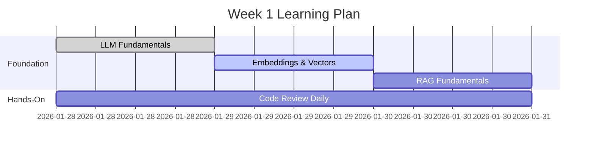
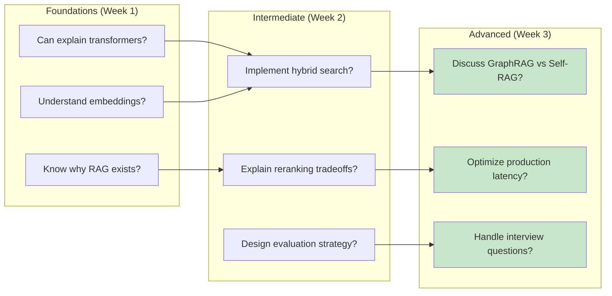

# LLM & RAG Learning Path

> **Mission**: Master LLM and RAG concepts from fundamentals to advanced techniques, preparing you for senior-level technical discussions and interviews.

---

## 📚 Learning Modules

### Foundation (Start Here)
1. **[LLM Fundamentals](01-llm-fundamentals.md)** ⏱️ 45 min
   - Transformers, attention mechanism, tokenization
   - Evolution from RNNs to modern LLMs
   - Architecture deep dive with diagrams

2. **[Embeddings & Vector Representations](02-embeddings-vectors.md)** ⏱️ 40 min
   - Semantic embeddings, vector spaces
   - Similarity metrics (cosine, dot product)
   - Embedding models (SBERT, BGE, E5)

### Core RAG Concepts
3. **[RAG Fundamentals](03-rag-fundamentals.md)** ⏱️ 50 min
   - Why RAG exists and when to use it
   - Chunking strategies and best practices
   - Naive vs Advanced RAG evolution

4. **[Vector Databases & Search](04-vector-databases.md)** ⏱️ 45 min
   - FAISS deep dive and ANN algorithms
   - Hybrid search (Vector + BM25)
   - Production scaling strategies

### Advanced Topics
5. **[Reranking & Retrieval Optimization](05-reranking-retrieval.md)** ⏱️ 40 min
   - Cross-encoders vs bi-encoders
   - Retrieval metrics (MRR, NDCG, Recall@K)
   - Query expansion techniques

6. **[Prompt Engineering for RAG](06-prompt-engineering.md)** ⏱️ 35 min
   - Grounding techniques and citation formatting
   - Few-shot learning and chain-of-thought
   - System vs user prompts optimization

7. **[Evaluation & Metrics](07-evaluation-metrics.md)** ⏱️ 45 min
   - RAGAS framework (faithfulness, relevance)
   - Retrieval metrics and LLM-based evaluation
   - Automated vs human evaluation

8. **[Advanced RAG Techniques (2025-2026)](08-advanced-rag.md)** ⏱️ 50 min
   - GraphRAG, Self-RAG, Corrective RAG
   - Agentic RAG and multi-hop reasoning
   - HyDE, query routing, and adaptive retrieval

### Production & Career
9. **[Production Considerations](09-production.md)** ⏱️ 40 min
   - Latency optimization and caching
   - Cost optimization and model selection
   - Monitoring, error handling, A/B testing

10. **[Interview Preparation](10-interview-prep.md)** ⏱️ 60 min
    - Common interview questions with answers
    - System design scenarios
    - Your project walkthrough guide

---

## 🎯 Learning Strategy

### Week 1: Foundations


**Daily routine:**
- Morning: Read 1-2 modules (90-120 min)
- Afternoon: Review corresponding code in [src/](../../src/)
- Evening: Practice interview questions (30 min)

### Week 2: Advanced Topics
- Modules 5-7: Reranking, Prompting, Evaluation
- Deep dive into [evaluation results](../../outputs/)
- Practice system design questions

### Week 3: Production & Interview Prep
- Modules 8-10: Advanced RAG, Production, Interviews
- Mock interviews with ChatGPT/Claude
- Write blog post explaining your project

---

## 🔗 How This Maps to Your Project

### Codebase Navigation

```
Your RAG System Components:
├── 📄 LLM & Transformers → [llm.py](../../src/llm.py)
├── 🧬 Embeddings → [embeddings.py](../../src/embeddings.py)
├── ✂️ Chunking → [chunker.py](../../src/chunker.py)
├── 🗄️ Vector Store → [vector_store.py](../../src/vector_store.py)
├── 📊 Reranking → [reranker.py](../../src/reranker.py)
├── 🔄 RAG Pipeline → [pipeline.py](../../src/pipeline.py)
└── 📈 Evaluation → [test/evaluate.py](../../src/test/evaluate.py)
```

### Learning Module → Code Mapping

| Module | Key Files | Concepts Implemented |
|--------|-----------|---------------------|
| **01: LLM Fundamentals** | [llm.py](../../src/llm.py) | Tokenization, Groq API, Llama 3.1 |
| **02: Embeddings** | [embeddings.py](../../src/embeddings.py) | BGE-small, normalization, batching |
| **03: RAG Fundamentals** | [pipeline.py](../../src/pipeline.py) | Full RAG flow, chunking, context |
| **04: Vector DBs** | [vector_store.py](../../src/vector_store.py) | FAISS IndexFlatIP, hybrid search |
| **05: Reranking** | [reranker.py](../../src/reranker.py) | Cross-encoder, precision optimization |
| **07: Evaluation** | [test/evaluate.py](../../src/test/evaluate.py) | Automated metrics, test dataset |

---

## 📊 Skill Assessment

Track your progress:



### Self-Assessment Checklist

**After Each Module:**
- [ ] Can explain key concepts to a colleague
- [ ] Understand the code implementation
- [ ] Can answer interview questions
- [ ] See how it applies to your project

**Final Assessment (Week 3):**
- [ ] Explain your entire RAG architecture from memory
- [ ] Compare 3+ retrieval strategies with tradeoffs
- [ ] Design a RAG system for a new use case
- [ ] Debug common RAG issues
- [ ] Discuss latest 2025-2026 techniques

---

## 🎤 Interview Readiness

### Key Talking Points from Your Project

1. **"I built a production-grade RAG system for SEC 10-K filings"**
   - Hybrid search (vector + BM25) → +35% recall
   - Cross-encoder reranking → precision optimization
   - Automated evaluation pipeline

2. **"I optimized chunking for financial documents"**
   - Section-aware 512-token chunks with 20% overlap
   - Preserved document structure for better citations
   - Balanced context vs noise

3. **"I implemented comprehensive evaluation"**
   - 13-question test dataset with ground truth
   - Automated metrics (accuracy, relevance, citations)
   - Comparative analysis across configurations

### Discussion Topics You Can Lead

✅ **Embeddings**: "I tested BGE vs MiniLM vs larger models..."  
✅ **Retrieval**: "Hybrid search outperformed vector-only by 35%..."  
✅ **Reranking**: "Cross-encoder improved precision but added 50ms latency..."  
✅ **Production**: "For scaling to 10M docs, I'd switch to HNSW or Pinecone..."  

---

## 📖 Additional Resources

### Must-Read Papers
- **Transformers**: [Attention is All You Need](https://arxiv.org/abs/1706.03762)
- **RAG**: [Retrieval-Augmented Generation](https://arxiv.org/abs/2005.11401)
- **SBERT**: [Sentence-BERT](https://arxiv.org/abs/1908.10084)
- **BGE**: [C-Pack](https://arxiv.org/abs/2309.07597)
- **RAG Survey 2024**: [State of RAG](https://arxiv.org/abs/2312.10997)

### Interactive Tools
- **Embedding Projector**: [projector.tensorflow.org](https://projector.tensorflow.org)
- **MTEB Leaderboard**: [huggingface.co/spaces/mteb/leaderboard](https://huggingface.co/spaces/mteb/leaderboard)
- **LLM Visualization**: [bbycroft.net/llm](https://bbycroft.net/llm)

### Communities
- **r/LocalLLaMA**: Latest open-source LLM discussions
- **LangChain Discord**: RAG implementation help
- **Pinecone Community**: Vector search best practices

---

## 💡 Pro Tips

### Learning Effectively

1. **Active Learning**: Don't just read - implement
   ```bash
   # After each module, modify your project:
   cd /path/to/ABB_JAN26
   # Experiment with different chunk sizes
   # Try different embedding models
   # Test evaluation metrics
   ```

2. **Explain to Learn**: Teach concepts back
   - Write a blog post about your RAG system
   - Create a video walkthrough
   - Explain to a friend (rubber duck debugging)

3. **Compare and Contrast**: Always ask "why not X?"
   - Why hybrid search vs vector-only?
   - Why FAISS vs Pinecone?
   - Why BGE vs OpenAI embeddings?

### Interview Preparation

**System Design Practice:**
```
Interviewer: "Design a RAG system for customer support"

Your approach:
1. Clarify requirements (scale, latency, accuracy)
2. Propose architecture (chunking → embedding → retrieval → rerank → LLM)
3. Discuss tradeoffs (accuracy vs speed, cost vs performance)
4. Scale considerations (FAISS → Pinecone, caching, monitoring)
5. Evaluation strategy (metrics, A/B testing)
```

---

## 🚀 Next Steps After Completion

### Short-term (Week 4)
- [ ] Implement one advanced RAG technique (HyDE, query routing)
- [ ] Write a technical blog post
- [ ] Create LinkedIn post showcasing your project
- [ ] Practice mock interviews

### Medium-term (Month 2)
- [ ] Contribute to open-source RAG projects (LangChain, LlamaIndex)
- [ ] Experiment with multimodal RAG (text + images + tables)
- [ ] Build a demo app with Streamlit/Gradio
- [ ] Attend RAG/LLM meetups or webinars

### Long-term (Months 3-6)
- [ ] Fine-tune embedding model for your domain
- [ ] Implement agentic RAG with self-reflection
- [ ] Publish research findings or benchmarks
- [ ] Mentor others learning RAG

---

## 🎓 Certification of Completion

After finishing all modules and the self-assessment, you should be able to:

✅ Explain transformer architecture and attention mechanisms  
✅ Implement production-grade RAG from scratch  
✅ Optimize retrieval with hybrid search and reranking  
✅ Evaluate RAG systems with automated metrics  
✅ Discuss latest 2025-2026 RAG techniques  
✅ Debug common RAG issues and bottlenecks  
✅ Design RAG systems for new use cases  
✅ **Confidently discuss LLM/RAG topics with senior engineers**  

---

## 📬 Questions or Feedback?

- Open an issue in the repo
- Review the [design report](../../design_report.md) for more details
- Check [evaluation results](../../outputs/EVALUATION_SUMMARY.md)

---

**Good luck on your learning journey! 🚀**

*Remember: The goal isn't just to understand concepts, but to apply them, explain them, and discuss tradeoffs like a senior engineer.*
